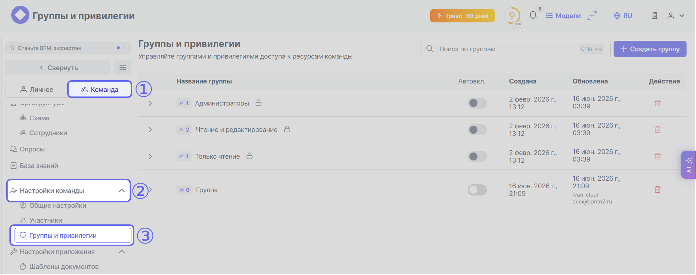
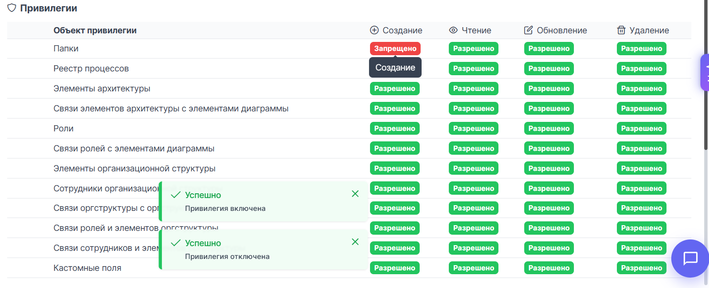
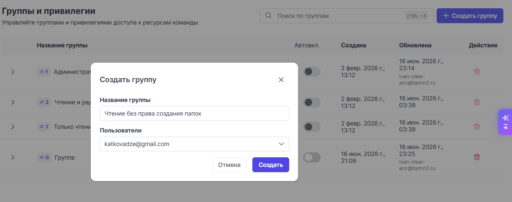
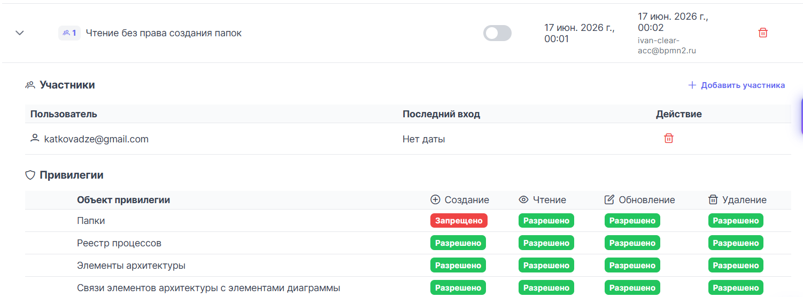
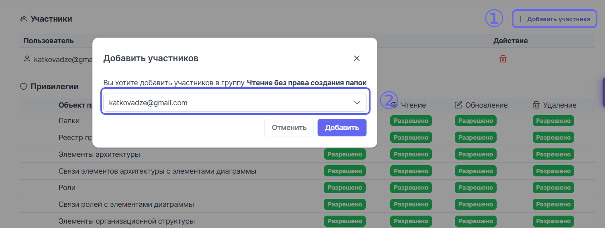

# Управление правами групп и участников

В {{ product_name }} есть система управления правами групп. Каждый пользователь в команде относится хотя бы к одной группе. Группа — это механизм управления доступом к проектам и функциям системы. Администратор команды {{ product_name }} может управлять составом групп и их правами через меню {{ team.icon }} {{ universal.right_arrow }} {{ team.team_settings.icon }} {{ universal.right_arrow }} {{ team.team_settings.groups }}:

По умолчанию раздел {{ team.team_settings.groups }} содержит три системные группы, которые нельзя удалить:

ℹ️🔽 "Администраторы"

    Группа **Администраторы** обладает максимально полными правами на все действия в системе.

ℹ️🔽 "Чтение и редактирование"

    Группа **Чтение и редактирование** обладает широким набором прав на чтение и редактирование объектов командной работы. Для группы действуют следующие наборы ограничений:

    | Объект привилегии | Создание | Чтение | Обновление | Удаление |
    |-------------------|----------|--------|------------|----------|
    | Элементы архитектуры | {{ team.groups.permitted }} | {{ team.groups.allow }} | {{ team.groups.permitted }} | {{ team.groups.permitted }} |
    | Роли | {{ team.groups.permitted }} | {{ team.groups.allow }} | {{ team.groups.permitted }} | {{ team.groups.permitted }} |
    | Пользовательские справочники | {{ team.groups.permitted }} | {{ team.groups.allow }} | {{ team.groups.allow }} | {{ team.groups.permitted }} |
    | Структура реестра процессов | {{ team.groups.permitted }} | {{ team.groups.allow }} | {{ team.groups.permitted }} | {{ team.groups.permitted }} |
    | Опросы | {{ team.groups.permitted }} | {{ team.groups.allow }} | {{ team.groups.allow }} | {{ team.groups.permitted }} | 

    {{ team.groups.permitted }} просматривать секцию {{ team.team_settings.icon }}.

ℹ️🔽 "Только чтение"

    Группа **Только чтение** обладает правами на чтение объектов командного доступа, при этом членам группы запрещено создание, обновление и удаление почти всех объектов группового доступа кроме следующих:

    | Объект привилегии | Создание | Чтение | Обновление | Удаление |
    |-------------------|----------|--------|------------|----------|
    | Связи элементов архитектуры с элементами диаграммы | {{ team.groups.allow }} | {{ team.groups.allow }} | {{ team.groups.allow }} | {{ team.groups.allow }} |
    | Связи ролей с элементами диаграммы | {{ team.groups.allow }} | {{ team.groups.allow }} | {{ team.groups.allow }} | {{ team.groups.allow }} |

    {{ team.groups.permitted }} просматривать секцию {{ team.team_settings.icon }}.

## Изменение привилегий групп

Администратор команды может включать или выключать любую привилегию в любой группе, включая группу **Администраторы**. Для изменения привилегии достаточно просто кликнуть по нужной привилегии и её статус изменится на противоположный:

## Гранулирование прав участников

Иногда может потребоваться более тонкое управление правами пользователей. Например, когда нужно запретить части пользователей работать с папками, но при этом оставить права на всё остальное. В таком случае можно создать отдельную группу, настроить набор прав и добавить пользователей в эту группу. 

Такой процесс может выглядеть так:

1. Кликните по кнопке  {{ universal.plus }} **Создать группу** в правом верхнем углу экрана раздела {{ team.team_settings.groups }}, введите название новой группы и сразу добавьте существующих пользователей, если надо:

    

2. По умолчанию новая группа создаётся с запретом на все действия. Включите только те привилегии, которые считаете нужными для группы:

    

3. (Опциональный шаг) Добавьте в новую группу участников, если приглашение на вступление в группу им было выслано после создания группы. Кликните по кнопке {{ universal.plus }} **Добавить участника** и выберите из выпадающего списка нужного вам участника:

    

Если на один и тот же объект привилегии выданы противоположные права в разных группах — больший вес имеет право {{ team.groups.allow }}. Например, если на создание папок в двух группах действует запрет, а в третьей создание разрешено — финальное право будет {{ team.groups.allow }}.  