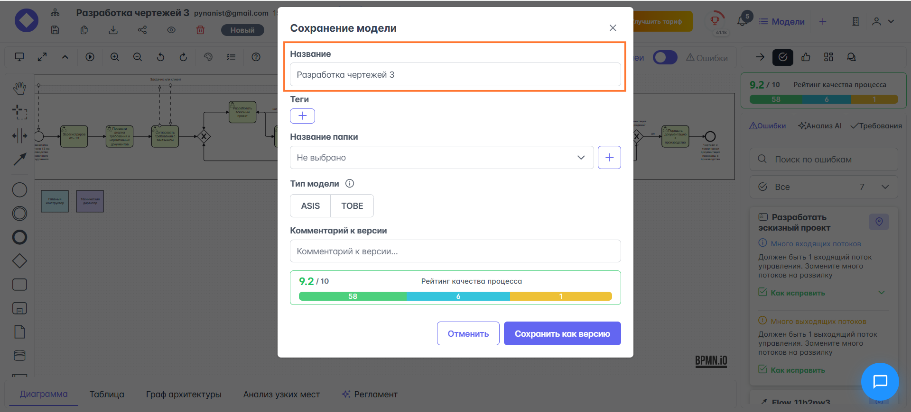
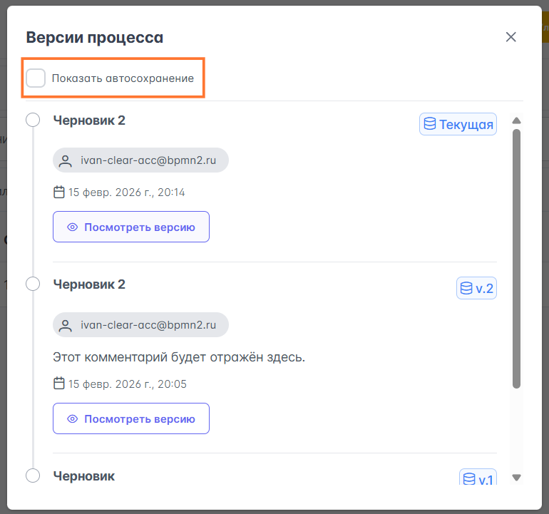
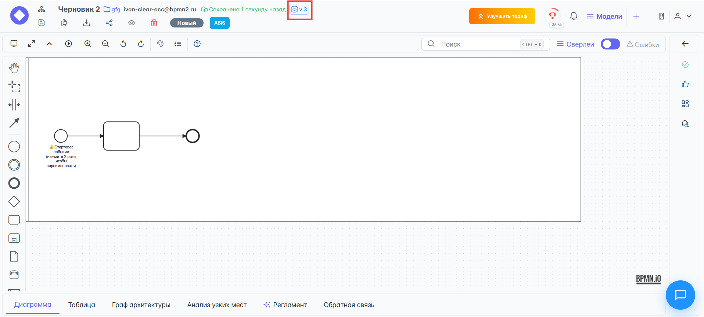
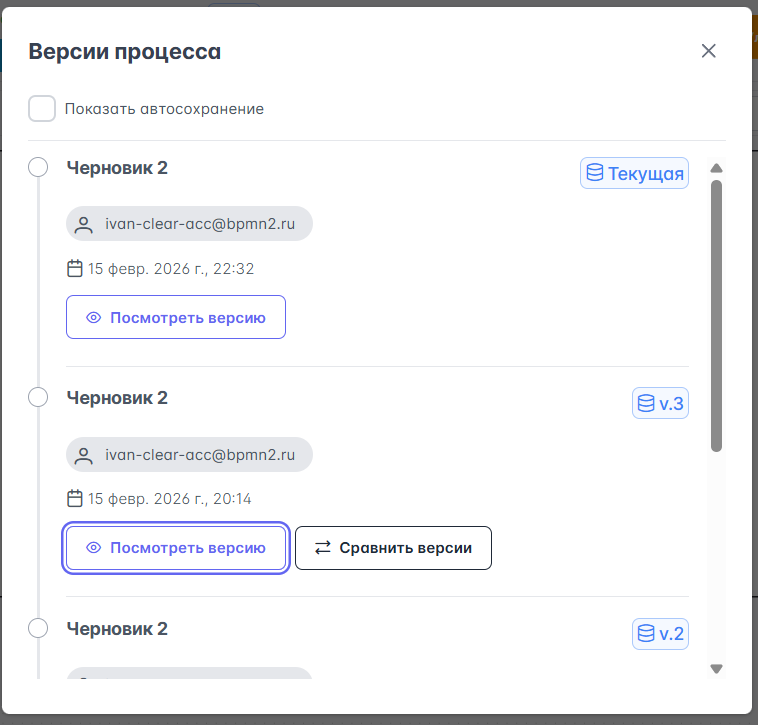
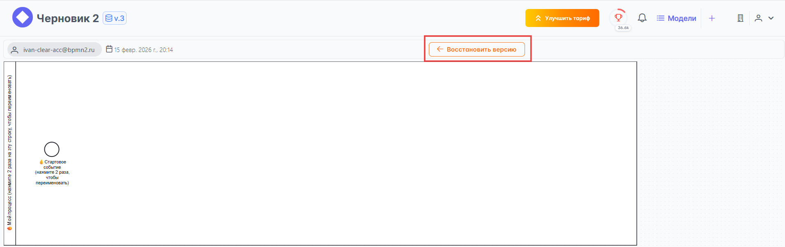
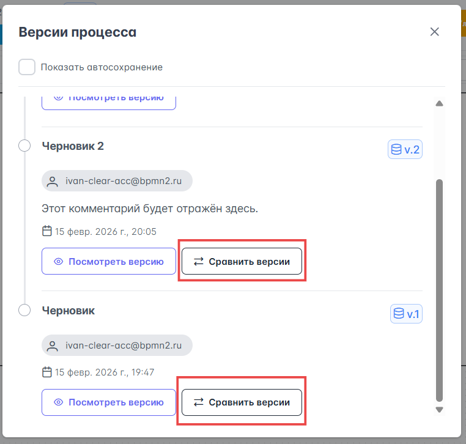
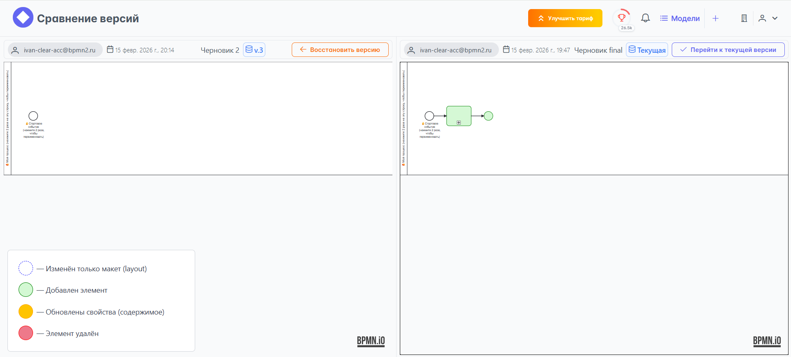

➡️ (_templates/warnings/perm_plan_role.md)

# Работа с версионированием процессов
Система версионирования в {{ product_name }} позволяет сохранять версию процесса по требованию в любое время, сравнить версии и восстановить процесс из версии. Также система создаёт автоматические версии, если в диаграмму было внесено больше 30 изменений или если кто-то, кроме владельца процесса, внёс изменения в диаграмму.

Система уведомляет автора диаграммы по e-mail, если в его диаграмме создаются новые версии.

## Ручное сохранение версии процесса

Находясь в редакторе процесса, нажмите на кнопку {{ process_editor.upper_toolbar.buttons.save_as_version }}:

В открывшемся модальном окне **Сохранение модели** введите следующие:

- **Название** (обязательно) — процесс будет сохранён в общем каталоге процессов и унаследует всю историю изменений.
- **Теги** (опционально) — дополнительная логическая разметка процесса, по которой можно быстро ориентироваться в каталогах.
- **Название папки** (опционально) — папка, куда будет сохранена новая версия процесса. Можно создать папку прямо из текущего интерфейса, нажав кнопку {{ process_editor.save_process_modal.buttons.plus }}. Нужны права **Администратора**.
- **Тип модели** (опционально): `ASIS` описывает текущее состояние процессов «как есть», а `TOBE` — желаемое «как должно быть» после улучшений. По умолчанию — `ASIS`.
- **Связанный процесс** (опционально) — процесс, который связан с текущей диаграммой, если есть.
- **Комментарий к версии** (опционально) — комментарий, который будет отражаться в карточке выбора версии. Полезно указать какие-нибудь отличительные свойства или черты данной версии процесса. Это поможет быстрее ориентироваться при выборе версии для восстановления.

Нажмите кнопку {{ process_editor.save_process_modal.buttons.save }} для сохранения новой версии процесса.

## Автосохранение версии процесса

{{ product_name }} автосохраняет версии процесса, если было совершено больше 30 изменений диаграммы или кто-то (не владелец процесса и не предыдущий автор изменения) внёс изменения в диаграмму.

Автосохранённые диаграммы по умолчанию не отображаются в истории версионирования процесса. Чтобы увидеть автосохранённые версии процесса нужно установить чекбокс {{ process_versions.checkboxes.show_autosave }}:

## Восстановление из определенной версии процесса

При восстановлении из определенной версии процесса будет создана точка восстановления в виде последней версии, а текущая версия процесса будет сохранена. Востановить процесс из версии можно несколькими путями:

1. Из редактора процесса:

    - Нажмите на кнопку {{ process_editor.upper_toolbar.buttons.show_all_versions}}:

        

    - В модальном окне **Версии процесса** выберите нужную вам версию процесса и нажмите кнопку {{ process_versions.buttons.view_version}}:

        

    - Для восстановления из выбранной версии — в окне просмотра процесса нажмите кнопку {{ view_process.buttons.cover_from_version }}:

        

        После нажатия на кнопку {{ view_process.buttons.cover_from_version }} — процесс будет восстановлен, откроется редактор процессов, а восстановленная версия станет текущей (последней).

2. Из раздела {{ section_team.buttons.team_switcher }}:

    * Разверните вкладку {{ section_team.layouts.business_models }} и перейдите в раздел {{ section_team.layouts.all_models }}.
    * Найдите в списке нужную вам модель процесса, прокрутите экран вправо и нажмите на кнопку {{ section_team.buttons.show_more}}.
    * Из выпадающего списка дополнительных действий выберите {{ section_team.buttons.all_versions}}.
    * В модальном окне **Версии процесса** выберите нужную вам версию процесса и нажмите кнопку {{ process_versions.buttons.view_version}}:

        

    * Для восстановления из выбранной версии — в окне просмотра процесса нажмите кнопку {{ view_process.buttons.cover_from_version }}:

        

        После нажатия на кнопку {{ view_process.buttons.cover_from_version }} — процесс будет восстановлен, откроется редактор процессов, а восстановленная версия станет текущей (последней).

## Сравнение версий процесса

!!! notice

    Данная функция доступна из редактора процессов.

Перед восстановлением из определенной версии полезно сравнить текущую версию с версией, из которой будет восстановлен процесс. Для сравнения версий в окне редактора процесса:

- Нажмите на кнопку {{ process_editor.upper_toolbar.buttons.show_all_versions}}:

    

- В модальном окне **Версии процесса** выберите нужную вам версию процесса и нажмите кнопку {{ process_versions.buttons.view_version_diff}}:

    

- Окно **Сравнение версий** разделено на две секции: левая секция отражает версию, из которой процесс будет восстановлен, а правая секция отражает текущую версию процесса:
    
    

    На диаграмме справа (текущая версия) цветами (значения цветов указаны в подсказке в левом нижнем углу экрана) отмечены изменения относительно версии диаграммы из которой будет восстановлен процесс.

    Если версия для восстановления верная — нажмите на кнопку {{ view_process.buttons.cover_from_version }}.

После нажатия на кнопку {{ view_process.buttons.cover_from_version }} — процесс будет восстановлен, откроется редактор процессов, а восстановленная версия станет текущей (последней).

## Дополнительные материалы

<iframe width="560" height="315" src="https://www.youtube.com/embed/s3X7z3WttIs?si=ZlHoZHG3-jO5YhsC" title="YouTube video player" frameborder="0" allow="accelerometer; autoplay; clipboard-write; encrypted-media; gyroscope; picture-in-picture; web-share" referrerpolicy="strict-origin-when-cross-origin" allowfullscreen></iframe>