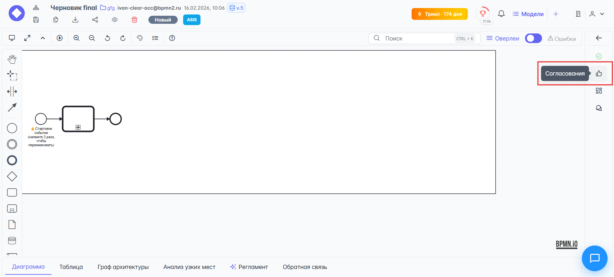
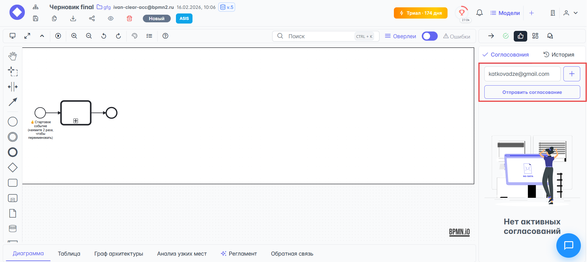
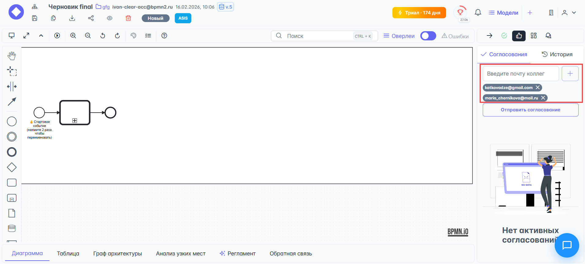
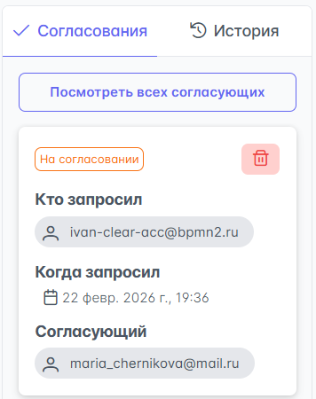
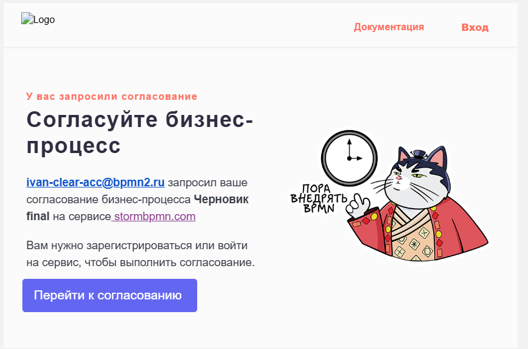
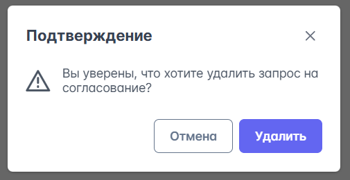
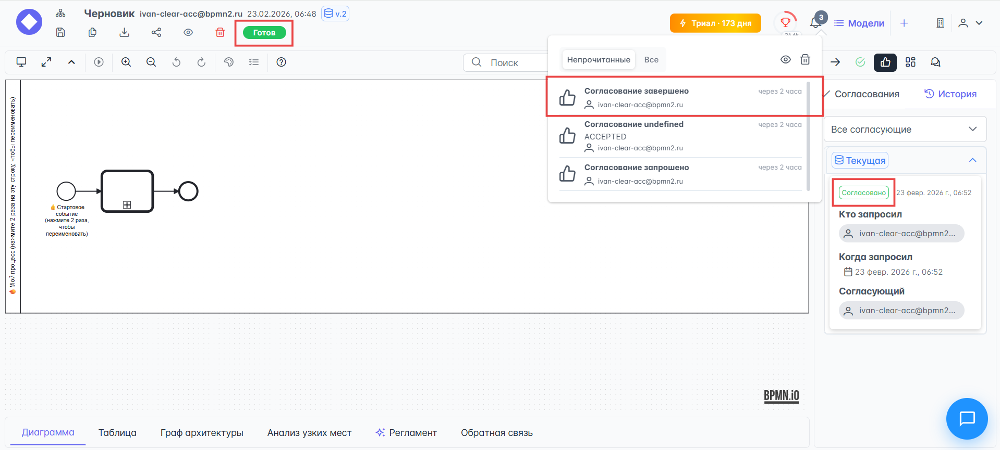
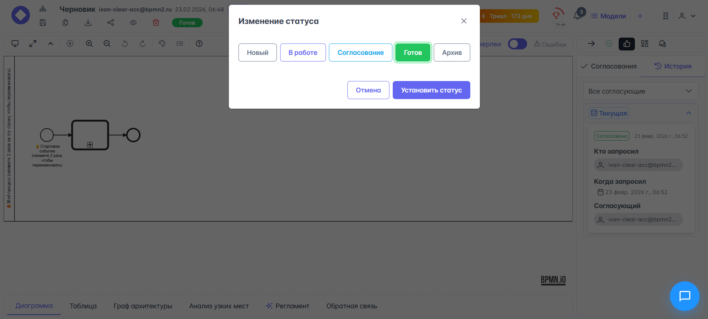

# {{ page.meta.title }}

В {{ product_name }} есть удобная система согласования процессов, которая позволяет отправить приглашение на почту на согласование процесса любому человеку, зарегистрированному в {{ product_name }}. Если приглашение на согласование было направлено человеку не зарегистрированному в {{ product_name }}, он его получит, но для принятия участия в согласовании ему всё равно нужно будет зарегистрироваться в {{ product_name }}.

!!! warning "Блокировка статуса диаграммы"

    После отправки схемы на согласование диаграмму нельзя будет редактировать или менять её статус, пока не будут получены результаты по **ВСЕМ** отправленным запросам на согласование.

**Для отправки процесса на согласование** выполните следующие шаги: 

- Перейдите в раздел **Редактор процессов**.
- Нажмите на кнопку {{ process_editor.right_toolbar.buttons.send_on_approve_open_menu }} на правой боковой панели управления:

    

- В открывшемся модальном меню **Согласования**, введите электронную почту согласующего в поле ввода почты, и нажмите кнопку {{ process_editor.right_toolbar.buttons.send_on_approve }} для отправки приглашения:

    

- Если нужно отправить приглашение нескольким пользователям: введите адрес почты в поле ввода электронной почты и нажмите кнопку {{ process_editor.right_toolbar.buttons.add_more_approvals }}, затем введите другой адрес:

    

    После ввода адресов для отправки нажмите кнопку {{ process_editor.right_toolbar.buttons.send_on_approve }}.

Система отправит приглашения согласующим и выведит в интерфейс сообщения с отчётом об отправке:

Согласующий получит письмо на почту со следующим содержимым:

**Если приглашение на согласование было отправлено ошибочно** или более не актуально, его можно отменить:

- Нажмите на кнопку {{ process_editor.right_toolbar.buttons.delete_approval_send}} в сообщении о приглашении:

    

- После нажатия на {{ process_editor.right_toolbar.buttons.delete_approval_send}} система попросит подтвердить удаление запроса на согласование:

    

    Нажмите на кнопку {{ process_editor.modals.delete_approval_request.buttons.delete }}, чтобы удалить запрос.

После согласования процесса ревьюерами в меню {{ process_editor.upper_toolbar.sections.messages }} появятся сообщения о статусе согласования, на правой боковой панели также изменится статус согласования и функция изменения статуса процесса вновь станет доступной:

Теперь можно дальше двигаться по процессу и переводить статус диаграммы в следующее состояние - **Готов**:

