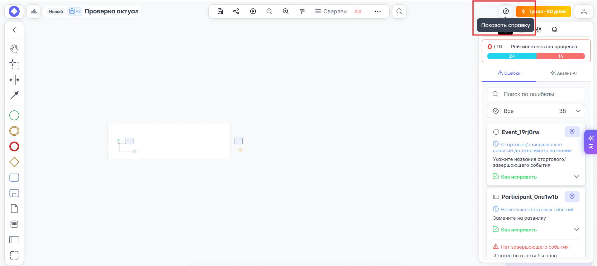

# Горячие клавиши

Редактор поддерживает работу с горячими клавишами, что сильно ускоряет работу при моделировании процессов:

- `F5` или `Ctrl` + `F5` - обновить страницу браузера
- `F11` - перейти в полноэкранный режим
- `Ctrl` + `K` - поиск элемента диаграммы
- `Ctrl` + `Z` - отменить последнее действие
- `Ctrl` + `Shift` + `Z` или `Ctrl` + `Y` - вернуть отмененное действие
- `Ctrl` + `Scroll` - изменение масштаба
- `Scroll` - перемещение по вертикали
- `Shift` + `Scroll` - перемещение по горизонтали
- `Ctrl` + `Click` - выделять элементы по одному в группу
- `Shift` + `Click` - выбрать элементы группой
- `Ctrl` + `A` - выделить всё
- `Ctrl` + `C` - копировать
- `Ctrl` + `V` - вставить скопированное (и между вкладками)
- `Ctrl` + `Shift` + `V` - вставить скопированное вместе с атрибутами (роли, ЭА, описание)
- `Alt` + `A` - включить отображение всех оверлеев
- `Alt` + `G` - включить подсветку элементов цветом роли
- `Alt` + `Shift` + `A` - изменить свёрнутость списка всех оверлеев
- `Alt` + `1...9` - включить отображение соответствующих оверлеев
- `Alt` + `Shift` + `3` - изменить свёрнутость списка оверлеев Системы
- `Alt` + `Shift` + `4` - изменить свёрнутость списка оверлеев Документы
- `W`, `A`, `S`, `D` - навигация между элементами диаграммы
- `Tab` - быстрое создание задачи
- `Shift` + `Tab` - быстрое создание шлюза
- `F` - вставка элемента
- `Shift` + `Q` или `Q` - смена типа элемента
- `Esc` - выход из режима копирования стилей (Format Painter)

Посмотреть полный и актуальный список горячих клавиш можно в справке. Чтобы посмотреть справку, кликните по кнопке {{ process_editor.upper_toolbar.doc }} в верхнем правом углу основного окна редактора BPMN-схем:

