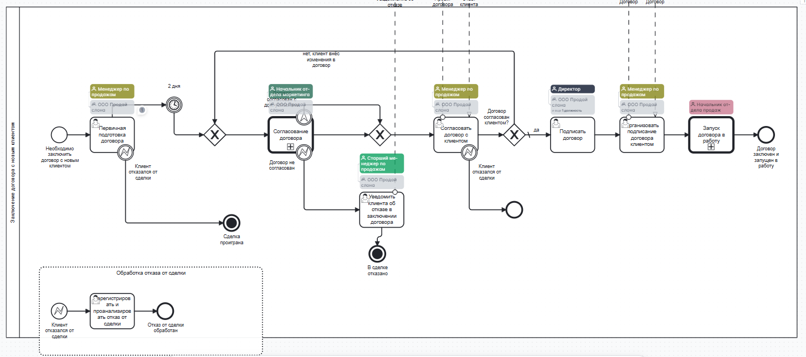
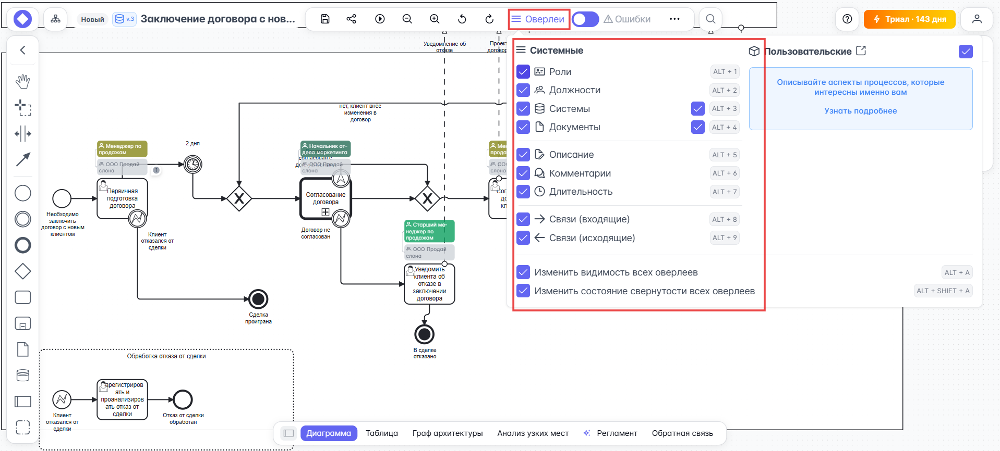
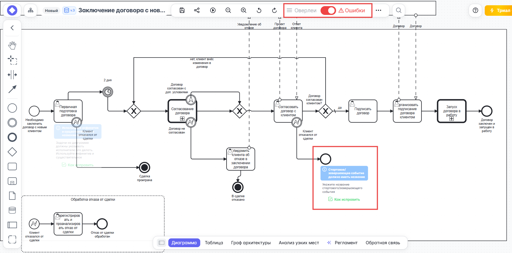
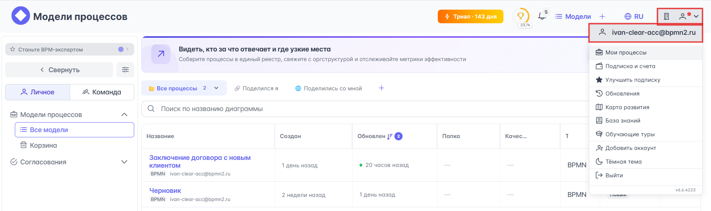
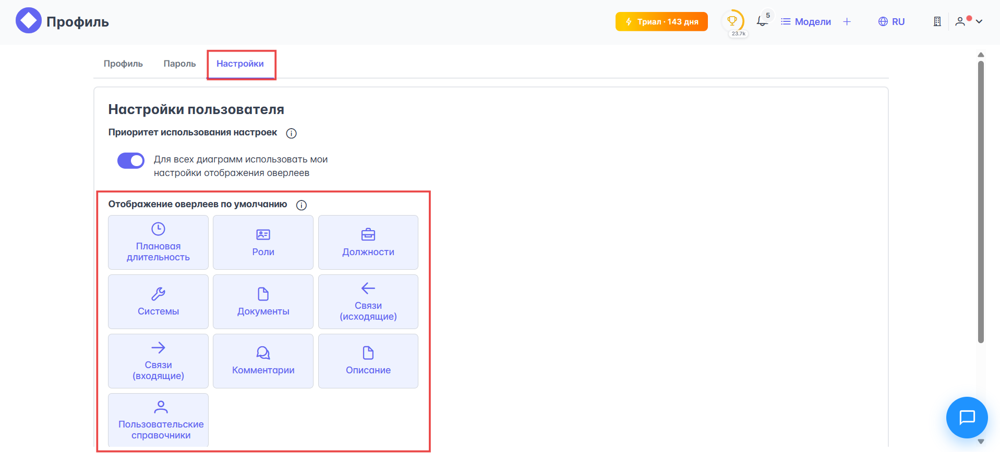

# {{ page.meta.title }}

**Overlay** (оверлей) — это дополнительный слой информации, который накладывается на диаграмму. На диаграмме оверлеи выполнены в приглушенных цветах с эффектом прозрачности — это сделано для того, чтобы не мешать основным элементам диаграммы:

Однако, когда диаграмма сложная, большое количество дополнительной информации может перегружать визуальное восприятие и мешать фокусироваться на главном — поэтому видимостью оверлеев можно управлять. Кликните по кнопке {{ process_editor.upper_toolbar.buttons.overlays }} и из появившегося меню выберите оверлеи, отображение которых хотите включить или выключить:

-  **Роли** — на диаграмме отображаются названия ролей, по которым можно кликнуть и вызвать карточку роли для просмотра детальной информации о роли или ее редактирования.
-  **Должности** — на диаграмме отображаются названия должностей.
-  **Системы** — на диаграмме отображаются названия систем.
-  **Документы** — на диаграмме отображаются значки документов возле элементов, к которым прикреплены документы, ссылки или инструкции.
-  **Описание** — на диаграмме отображаются значки описания возле элементов, для которых заполнено текстовое описание.
-  **Комментарии** — на диаграмме отображаются значки комментариев с их количеством возле элементов, где они были оставлены.
-  **Длительность** — на диаграмме отображаются длительности таймеров.
-  **Связи (входящие)** — на диаграмме отображаются входящие связи выбранного элемента.
-  **Связи (исходящие)** — на диаграмме отображаются исходящие связи выбранного элемента.

Если вы хотите отключить видимость всех оверлеев, деактивируйте чек-бокс {{ process_editor.upper_toolbar.sections.overlays.overlays_show }}. Отдельно можно свернуть или развернуть оверлеи  **Системы** и  **Документы** с помощью чекбокса {{ process_editor.upper_toolbar.sections.overlays.overlays_hide }}.

Также на диаграмме можно отображать ошибки работы с элементами диаграммы. Для этого нужно переключить тумблер справа от кнопки {{ process_editor.upper_toolbar.buttons.overlays }} с **Оверлеи** на **Ошибки**:

## Определение видимости оверлеев по умолчанию

Когда долго и много работаешь с диаграммами, вырабатывается личное предпочтение того, какие оверлеи должны быть отражены по умолчанию, а какие скрыты. Кликать каждый раз по кнопке {{ process_editor.upper_toolbar.buttons.overlays }} и активировать нужные чекбоксы с оверлеями утомительно — хочется один раз задать настройку отображения оверлеев для всех диаграмм. Такая возможность есть:

1. В главном меню {{ product_name }} кликните по профилю в правом верхнем углу.
1. Из выпадающего списка выберите первый пункт с вашим email:

    

1. Перейдите в раздел **Настройки** и выберите оверлеи, которые будут отображаться по умолчанию во всех диаграммах:

    

1. Кликните по кнопке **Сохранить**, чтобы настройки видимости оверлеев применились.

Теперь видимость оверлеев во всех диаграммах, которые вы будете открывать, будет определяться текущими настройками видимости.
