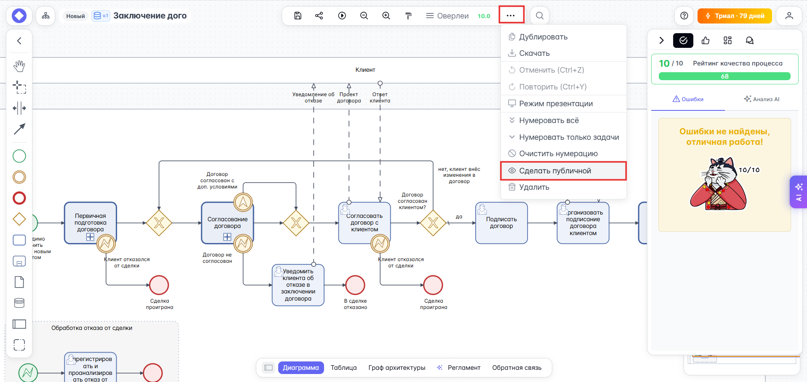

# Управление видимостью диаграммы

В командной работе разделение прав, изоляция ресурсов и управление видимостью материала — важные и значимые инструменты менеджмента командной работы. При разработке материала полезно его скрыть от всех до момента презентации или совместного/перекрёстного ревью. В {{ product_name }} есть система управления видимостью диаграмм.

Можно сделать диаграмму публичной — доступной для команды и всех желающих по ссылке, или скрыть её от всех. Для изменения видимости диаграммы:

1. Перейдите в основное окно редактора диаграмм.
1. Кликните по кнопке {{ process_editor.upper_toolbar.buttons.extra }} в верхней панели управления и из выпадающего списка выберите пункт {{ process_editor.upper_toolbar.buttons.make_private }} или {{ process_editor.upper_toolbar.buttons.make_public }} в зависимости от задачи:
    