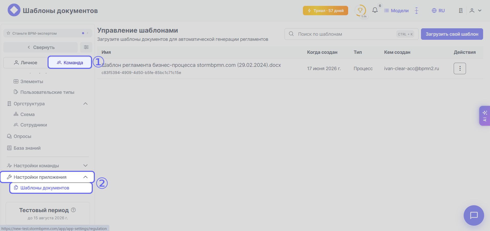
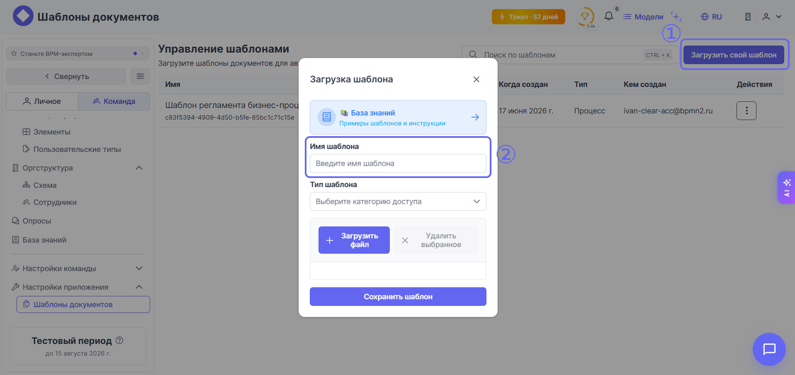
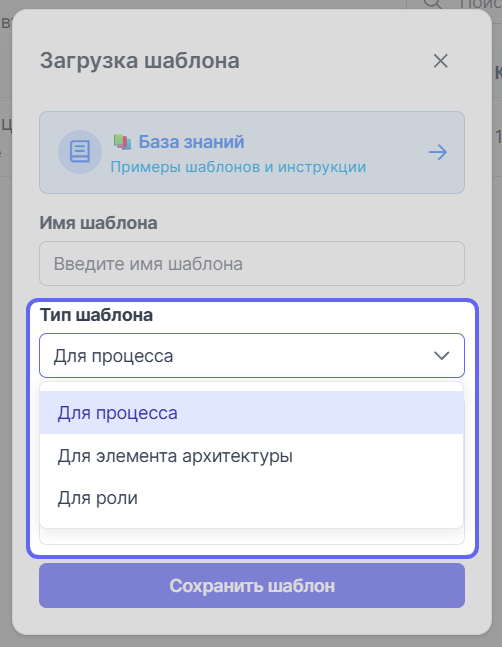
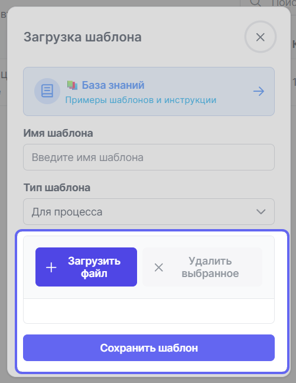
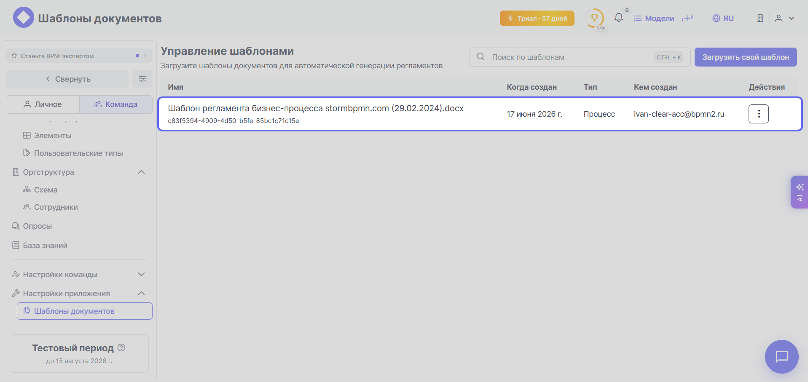
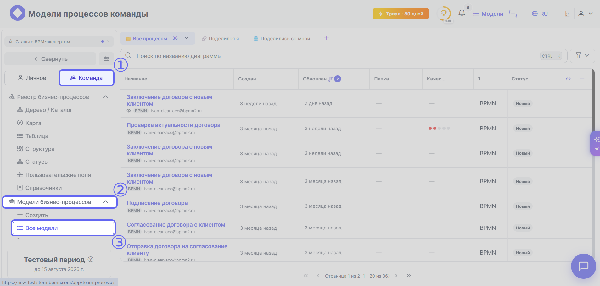
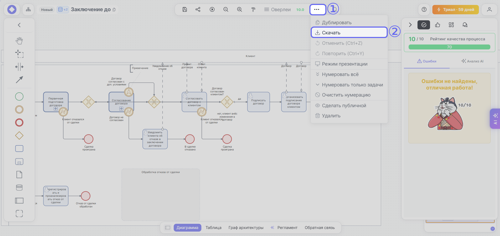
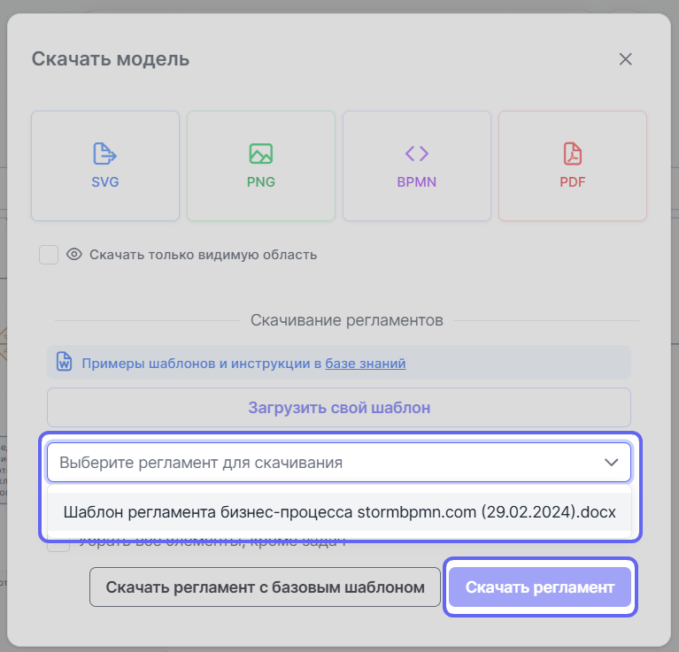

# Регламент бизнес-процесса: создание шаблона, его загрузка и выгрузка готового регламента

<div class="admonition-container" markdown="1">

➡️ (_templates/warnings/plan.md)
➡️ (_templates/reglaments/main_info.md)

</div>

Регламент бизнес-процесса может составить аналитик или другой ответственный из команды. Регламенты в {{ product_name }} составляются на базе шаблонов, написанных на языке [**SpEL**](https://docs.spring.io/spring-framework/reference/core/expressions.html) (Spring Expression Language). Шаблоны должны быть в формате DOCX.

## Подготовка шаблона регламента бизнес-процесса

ℹ️ "Доступные для выгрузки логические блоки"
    Сейчас для выгрузки доступны следующие логические блоки: описание процесса, история версий, схема бизнес-процесса, участники процесса, исполнители процесса, описание всех шагов процесса (с ролями и элементами архитектуры), связи с другими процессами, элементы архитектуры, согласование.


Для подготовки шаблона регламента бизнес-процесса нужно сначала ответить на следующие вопросы:

- Зачем нужен регламент?
- Для кого мы его пишем?
- Как он может помочь улучшить существующие бизнес-процессы?
- Как его можно использовать?
- Какие задачи с помощью его можно решить?

Когда структура регламента будет продумана, можно переходить к технической части работы — разметки шаблона с помощью **SpEL**. Удобнее делать разметку в MarkDown, после — конвертировать в DOCX. Кратко опишем свойства разметки **SpEL** и приведём используемые теги. Теги в **SpEL** обозначаются с помощью парных фигурных скобочек и названия тега между ними: `{{  название тега  }}`. Существуют также теги экстракторы, которые предоставляют доступ к информации основного тега, если тег содержит массив данных, например: 


Также есть и специальные теги, которые содержат объекты. Например: ``{``{` spel_tags.tables.special `}``}``

### Теги общей информации


### Табличные теги

1. Таблица участников:


1. Таблица исполнителей процессов:

```
`{`{` assigneesListTable `}`}`
    [name] - название исполнителя
    [type] - тип исполнителя 
    [count] - количество задач
```
    
1. Таблица связей процесса:

```
<span>{</span>{ processCollaboration }<span>}</span>
    [type] - тип  связи (мессадж, коллактивити)
    [fromDiagramName] - название диаграммы, откуда идет связь
    [fromItemName] - название элемента диаграммы, откуда идет связь
    [toDiagramName] - название диаграммы, куда идет связь
    [toItemName] - название элемента диаграммы, куда идет связь
```

    
1. Таблица элементов архитектуры процесса (без повторений):

<div v-pre>
<pre><code>
{{ processAssets }}
    [assetType] - тип элемента архитектуры
    [assetTypeStr] - тип элемента архитектуры на русском
    [assetName] - название элемента архитектуры
    [+assetDescription] - описание элемента архитектуры
    [assetLink] - внешняя ссылка
    [assetLinkReg] - красивая кликабельная ссылка, где под именем ссылка
</code></pre>
</div>
    
1. Таблица элементов архитектуры процесса в привязке к задачам:
        
<div v-pre>
<pre><code>
{{ processAssetsToActivity }}
    [assetType] - тип элемента архитектуры
    [assetTypeStr] - тип элемента архитектуры на русском
    [assetName] - название элемента архитектуры
    [+assetDescription] - описание элемента архитектуры
    [fromItemName] - элемент, к которому прикреплен элемент архитектуры
    [assetLink] - внешняя ссылка строкой
    [assetLinkReg] - внешняя ссылка с положенной ссылкой в ворде
</code></pre>
</div>
    
1. Таблица согласования процесса:
        
<div v-pre>
<pre><code>
{{ processApprovals }}
    [createdOnStr] - дата создания согласования
    [approvalTimeStr] - дата принятия решения согласования
    [approverEmail] - емейл согласующего
    [status] - статус согласования
    [comment] - комментарий согласования
    [diagramVersion] - версия, по которой принято решение
</code></pre>
</div>
       
### Массивы тегов

1. Массив описания задач:
        
<div v-pre>
<pre><code>
{{ ?assigneesListDescription }} - начало массива
    {{ activityName }} - название элемента диаграммы (задачи)
    {{ elementType }} - тип элемента (событие, шлюз, задача)
    {{ durationString  }} - строка длительности задачи
    {{ activityPoolName }} - пул задачи
    {{ assigneeName }} - название исполнителя
    {{ +activityDescription }} - описание действия
    {{ elementList }} - элементы архитектуры внутри задачи (строкой)
    {{ ?assetList }} - элементы архитектуры, связанные с задачей, массивом (начало)
        {{ assetType }} -тип элемента архитектуры
        {{ assetTypeStr }} - тип элемента архитектуры на русском
        {{ assetName }} - название элемента архитектуры
        {{ +assetDescription }} - описание элемента архитектуры
        {{ assetLink }} -внешняя ссылка
        {{ assetLinkReg }} - красивая кликабельная ссылка, где под именем ссылка
    {{ /assetList }} - окончание массива элементы архитектуры, связанные с задачей
{{ /assigneesListDescription }} - окончание массива описания задач
</code></pre>
</div>

1. Массив пулов с описанием задач в каждом из них:
        
<div v-pre>
<pre><code>
{{ ?assigneesListDescriptionByPool }} - начало массива пулов
    {{ first }} - название пула
    {{ ?second }} - начало массива задач в пуле
        Внутри него те же хэштеги описания задач, что описаны выше:
        {{ activityName }} - название элемента диаграммы
        ...
    {{ /second }} - окончание массива задач в пуле
{{ /assigneesListDescriptionByPool }} - окончание массива пулов
</code></pre>
</div>

### Теги объектов

Картинка схемы (требует ручного изменения под масштаб страницы после выгрузки): 

<div v-pre>
<pre><code>
{{ @processDiagram }}
</code></pre>
</div>

## Загрузка/выгрузка шаблонов

После того как шаблон будет подготовлен, его нужно загрузить через раздел {{ setup_app.icon }} {{ universal.right_arrow }} {{ setup_app.reglaments_templates }}:



1. Кликните по кнопке **Загрузить свой шаблон** в правом верхнем углу.
1. Задайте имя шаблона:

    

1. Выберите тип шаблона — **Для процесса**:

    

1. Загрузите шаблон и нажмите кнопку **Сохранить шаблон**:

    

После загрузки шаблона, он будет показан в списке загруженных шаблонов:



### Выгрузка регламента по шаблону

Перейдите в диаграмму и выгрузите регламент по шаблону:

1. Перейдите в раздел {{ team.icon }} {{ universal.right_arrow }} {{ bs_models.bs_m }} {{ bs_models.models_list }}:

    
1. Выберите нужную вам модель процесса.
1. Кликните по {{ universal.extra }} в верхней панели инструментов и из выпадающего списка выберите пункт {{ universal.download }} **Скачать**:

    
1. Выберите шаблон регламента для скачивания из выпадающего списка и нажмите кнопку **Скачать регламент**:

    

Откройте выгруженный регламент удобным для вас приложением, работающим с DOCX и проверьте, что все теги отработали верно и разметка не съехала. Если какой-то тег не сработал — проверьте его название и синтаксис. 