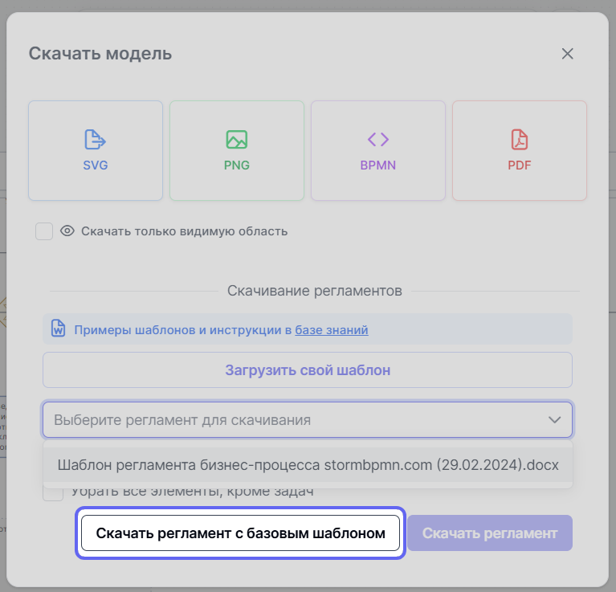

# Согласование регламентов

➡️ (_templates/reglaments/main_info.md)

Регламенты формируются на базе шаблонов, которые подготавливает администратор команды или аналитик. Шаблоны загружаются через раздел {{ setup_app.icon }} {{ universal.right_arrow }} {{ setup_app.reglaments_templates }}.

Далее, в зависимости от типа шаблона, согласующий может либо самостоятельно выгрузить нужный регламент и согласовать его, либо делегировать выгрузку участникам группы, оставив за собой только согласование. Эта инструкция описывает полный цикл работ с регламентами: выгрузку и согласование. 

## Выгрузка и согласование регламента процесса

1. Перейдите в раздел {{ team.icon }} {{ universal.right_arrow }} {{ bs_models.bs_m }} {{ bs_models.models_list }}:

    

1. Выберите нужную вам модель процесса.

1. Кликните по {{ universal.extra }} в верхней панели инструментов и из выпадающего списка выберите пункт {{ universal.download }} **Скачать**:

    

1. Выберите шаблон регламента для скачивания из выпадающего списка и нажмите кнопку **Скачать регламент**:

    

    Если подготовленного шаблона нет, можно скачать регламент с базовым шаблоном:

    

1. Откройте сохранённый шаблон в Microsoft Office или с помощью Google Docs. Согласуйте его с помощью средств электронной подписи или классическим путём. 

Если требуется внести изменения в регламент — обратитесь к ответственному лицу и попросите внести правки в шаблон регламента. 