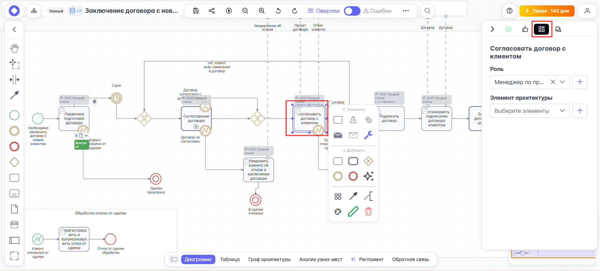
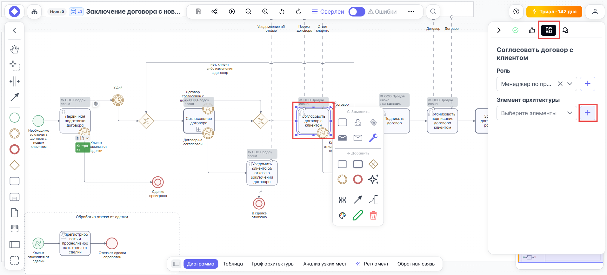
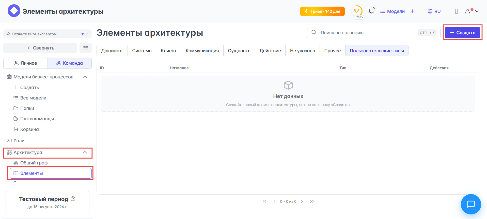
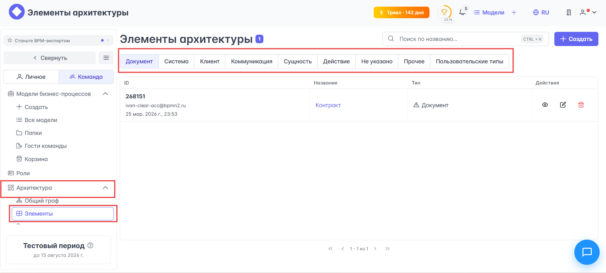
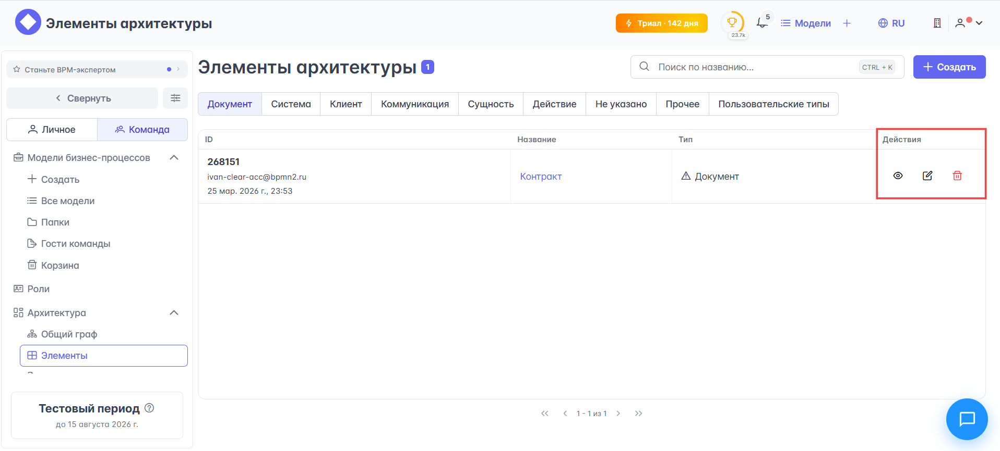
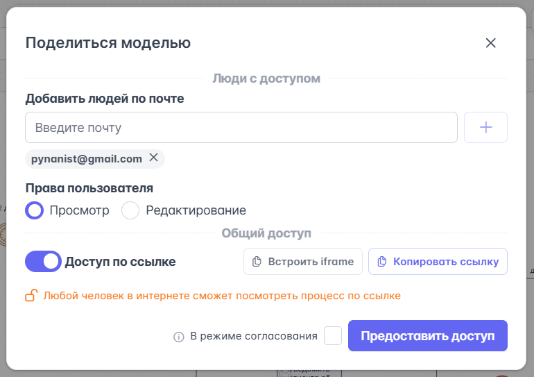

# {{ page.meta.title }}

**Элементы архитектуры** (ЭА) нужны, чтобы показывать, какие ресурсы и объекты используются при выполнении задачи. По сути, это более удобная и продвинутая альтернатива обычным элементам BPMN — таким как объект данных и артефакты. Они помогают не захламлять диаграмму лишними деталями. При этом, если включить их отображение, процесс становится гораздо понятнее, потому что сразу видно, что именно требуется для его выполнения.

Типы ЭА:

- **Документ** — артефакт, содержащий контекст бизнес-процесса: инструкция, договор, письмо.
- **Система** — программное обеспечение, интеграция, API, любая система или программа, которую можно использовать для выполнения пользовательской или сервисной задачи.
- **Клиент** — дополнительный тип элемента архитектуры для обозначения клиента или другого внешнего участника процесса.
- **Коммуникация** — отражает способ или канал коммуникации.
- **Сущность** — дополнительный тип элемента архитектуры для обозначения бизнес-сущности или объекта данных.
- **Действие** — используется для типизации действий, абстрактных задач и ручных операций.
- **Не указано** — тип элемента архитектуры, который можно использовать, если подходящая категория еще не определена.
- **Прочие** — дополнительный тип для объектов, которые не относятся к другим типам элементов архитектуры.

Если среди предложенных типов ЭА не нашлось нужного именно вам — можно создать собственный тип ЭА с помощью конструктора пользовательских типов.

Опишем несколько путей создания ЭА.

## Создание ЭА

!!! warning "Элементы архитектуры и переход в другую команду, выход из команды"

    Элементы архитектуры (ЭА) относятся к объектам команды поэтому при выходе из команды, переходе в другую команду, оверлеи ЭА удаляются с диаграмм.

Создать ЭА можно в редакторе диаграмм или в разделе {{ section_team.layouts.architecture}} {{ universal.right_arrow }} {{ architecture.elements }}. 

### Создания ЭА в редакторе диаграмм

1. Перейдите в редактор диаграмм.
1. Выбирете задачу, к которой хотите привязать ЭА и в правом боковом меню выбирете раздел {{ process_editor.right_toolbar.buttons.archetecture }}:

    

1. Кликнете на кнопку {{ universal.plus }} **Создать элемент архитектуры**:

    

1. В открывшемся модальном окне **Создание элемента архитектуры** выполните следующие действия:

- В поле **Название** введите краткое, понятное, односложное название ЭА.
- Из выпадающего списка **Тип** выберите нужный вам тип ЭА.
- Задайте **Цвет элемента** (опционально).
- Секция **Статус и интеграция** заполняется при необходимости и является опциональной.
- Выбирете **Статус** ЭА.

1. Сохраните новый ЭА.

### Создания ЭА в разделе {{ architecture.elements }}

1. Перейдите в раздел {{ section_team.layouts.architecture}} {{ universal.right_arrow }} {{ architecture.elements }} и кликнете на кнопку {{ universal.plus }} **Создать**:

1. В открывшемся модальном окне **Создание элемента архитектуры** выполните следующие действия:

- В поле **Название** введите краткое, понятное, односложное название ЭА.
- Из выпадающего списка **Тип** выберите нужный вам тип ЭА.
- Задайте **Цвет элемента** (опционально).
- Секция **Статус и интеграция** заполняется при необходимости и является опциональной.
- Выбирете **Статус** ЭА.

1. Сохраните новый ЭА.

## Просмотр списка ЭА

Раздел {{ section_team.layouts.architecture}} {{ universal.right_arrow }} {{ architecture.elements }} содержит удобную таблицу со всеми ЭА с удобной и понятной навигацией по типам ЭА:

Каждый ЭА имеет свой ID, название, тип и набор действий, которые можно совершить над ним, к их числу отноятся:

- <i class = "pi pi-eye" ></i> Просмотр списка диаграмм, где используется ЭА.
- <i class = "pi pi-pen-to-square"></i> Редактирование свойств ЭА.
- <i class = "pi pi-trash"></i> Удаление ЭА.

## Передача диаграмм с ЭА в другую команду
Если нужно передать диаграмму с элементами архитектуры в другую команду, создайте ее дубликат в другом аккаунте.

Для этого:

1. Перейдите в редактор диаграмм.
1. На верхней панели кликнете по кнопке <i class = "pi pi-share-alt"></i> **Поделиться**.
1. В  открывшемся модальном окне **Поделиться моделью** укажите e-mail аккаунта получателя или включите **Доступ по ссылке** и скопируйте ссылку:

    

1. В аккаунте-получателе откройте переданную диаграмму по полученной ссылке.
1. Создайте копию диаграммы одним из способов:

- Отройте редактор диаграмм и в верхнем меню открытой диаграммы нажмите кнопку <i class = "pi pi-copy"></i> **Дублировать**.
- На главной странице на верхней панели нажмите кнопку {{ universal.plus }} и из выпадающего списка выберите <i class = "pi pi-box"></i> **BPMN**, затем в открывшемся окне нажмите **Скопировать модель** и вставьте ссылку на исходную диаграмму.

После этого в аккаунте-получателе будет создана отдельная копия диаграммы, с которой можно работать уже в другой команде.