# Работа с оргструктурой

Оргструктура в {{ product_name }} — это не кадровая, а управленческая структура, которая призвана визуально отразить управленческую структуру и связать воедино роли, задачи и процессы. 

Методологически {{ org.icon }} в {{ product_name }} оперирует тремя сущностями:

- {{ org.boss }} — это руководитель любого уровня, в подчинении у которого есть организационная структура и люди.
- {{ org.position }} — это любая должность в подчинении, у которой нет организационной структуры (но в подчинении могут быть другие должности/люди).
- {{ org.group }} — это любая организационная структура, в которой работают люди. Например, это может быть отдел, подразделение, целая компания, холдинг, совет директоров и так далее.

{{ org.icon }} — это просто иерархическое представление управленческой структуры и связей между ролями, задачами и процессами. Такая связь может однозначно ответить, что именно делает конкретная должность или даже сотрудник в бизнес-процессах:

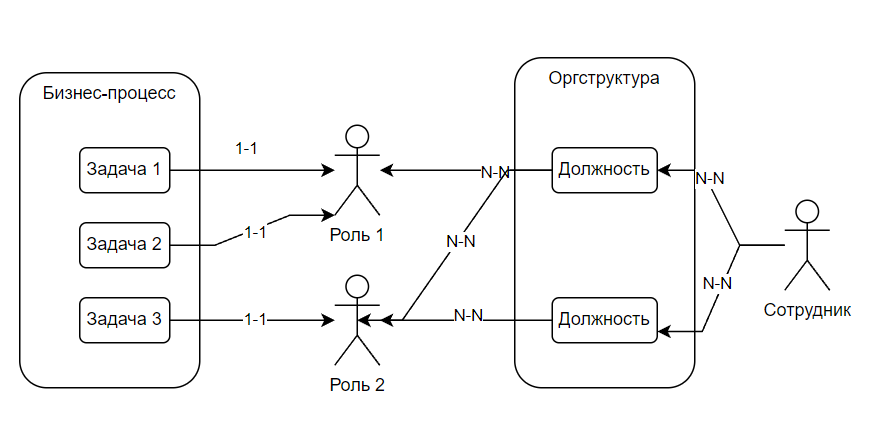

Несмотря на то, что {{ org.icon }} — это не жесткая структура, она всё равно строится, основываясь на следующих ограничениях и правилах:

- У **задачи** может быть только 1 **роль**.
- **Должность** может выполнять сколько угодно **ролей**.
- **Роль** может выполняться каким угодно количеством **должностей**.
- **Сотрудник** может быть назначен на любое количество **должностей**.
- **Сотрудник** не может быть назначен на **задачу** напрямую.

## Создание оргструктуры

Оргструктура создаётся в {{ team.icon }} {{ universal.right_arrow }} {{ org.icon }} {{ universal.right_arrow }} {{ org.scheme }}:

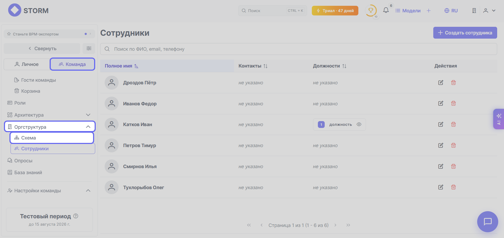

Методологически раздел {{ org.scheme }} не может быть пустым. По умолчанию при первом заходе в него в нём будет находиться минимальная оргструктура: **Руководитель** + **Группа**:

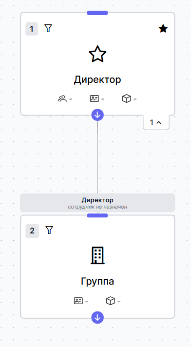

Изменяя дефолтную оргструктуру можно получить собственную оргструктуру, отвечающую вашим требованиям и представлениям. Вот как это можно сделать:

1. Переименуйте главного **Руководителя** по своему усмотрению, дважды кликнув на его должность.
1. Переименуйте существующую **Группу** или добавьте ещё одну **Группу**. Для этого кликните по карточке **Руководителя**, которому в подчинение хотите добавить **Группу**, и в появившемся меню действий наведите на {{ universal.plus }} и выберите **Добавить группу в подчинение**:

    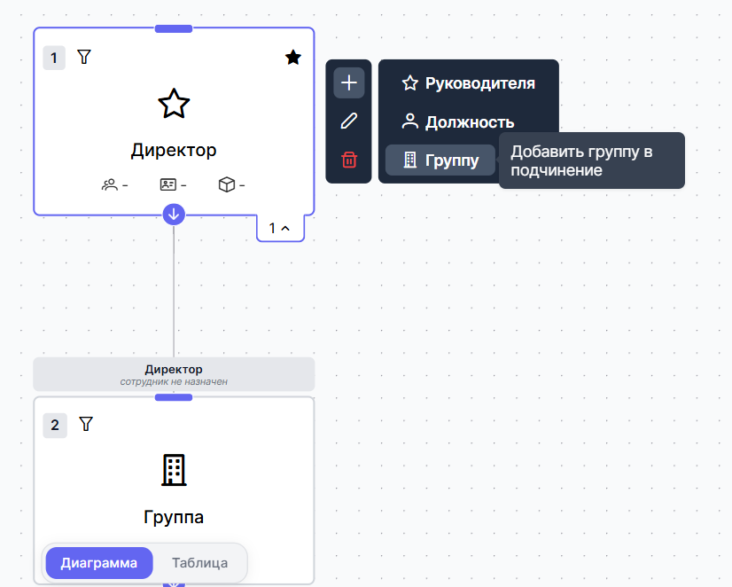

После переименования должности и добавления двух **Групп** наша диаграмма выглядит так:

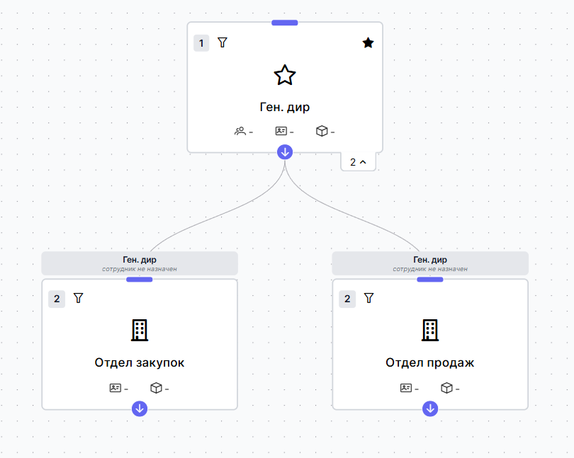

Теперь добавьте **Руководителей** отделам. Для этого кликните по карточке с отделом и в появившемся меню действий наведите на {{ universal.plus }} и выберите **Добавить руководителя и группу в подчинение**:

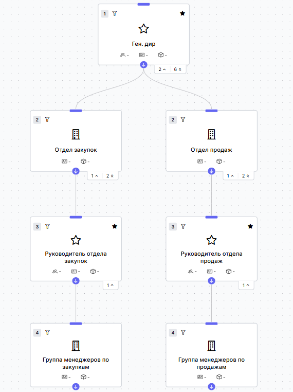

После добавления **Руководителей** и новых групп им в подчинение, добавьте **Должностей** в подчинение. Это делается аналогичным образом с добавлением **Руководителей** и **Групп** через меню по клику по карточке.

В итоге, наша диаграмма теперь выглядит так:

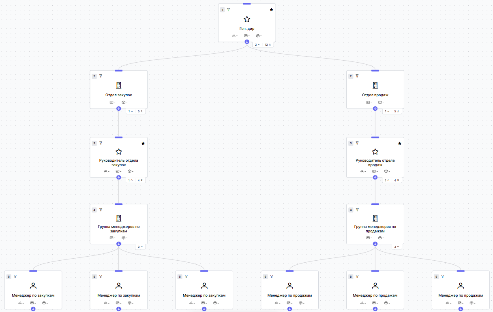

Но сейчас в диаграмме есть только организационная составляющая: названия должностей и структурных единиц без конкретных исполнителей и бизнес-процессов. Исправим это и привяжем конкретных людей к должностям.

## Создание карточек сотрудников

Чтобы привязать конкретного человека к должности и процессу нужно создать карточку сотрудника. Для этого нужно выполнить следующие шаги:

1. Перейдите в {{ team.icon }} {{ universal.right_arrow }} {{ org.icon }} {{ universal.right_arrow }} {{ org.staff }}:

    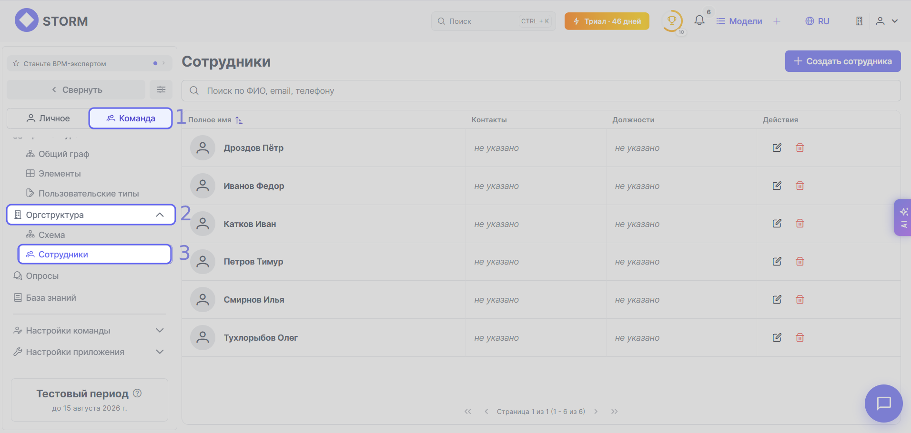

1. Кликните по кнопке {{ universal.plus }} **Создать сотрудника** в правом верхнем углу и заполните поля карточки:

- Фамилия и Имя сотрудника обязательны для заполнения.
- Отчество, Телефон, Email и фото — опциональные поля, они не отражаются в диаграммах.

После создания и сохранения карточек сотрудников их можно привязывать к организационной структуре. 

## Привязка должностей оргструктуры к карточкам сотрудников

1. Перейдите в {{ team.icon }} {{ universal.right_arrow }} {{ org.icon }} {{ universal.right_arrow }} {{ org.scheme }}:

    

1. Кликните по карточке **Начальника** или **Должности**, к которой хотите привязать сотрудника, и нажмите на {{ org.edit_node }}:

    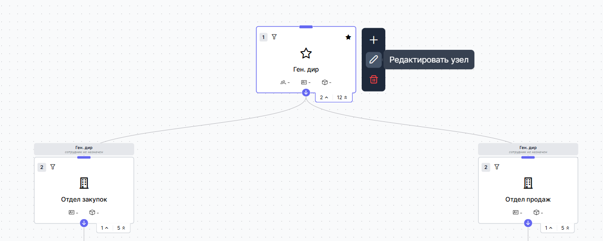

1. Кликните по вкладке **Сотрудники**, выберите нужного сотрудника из выпадающего списка и нажмите кнопку **Назначить**:

    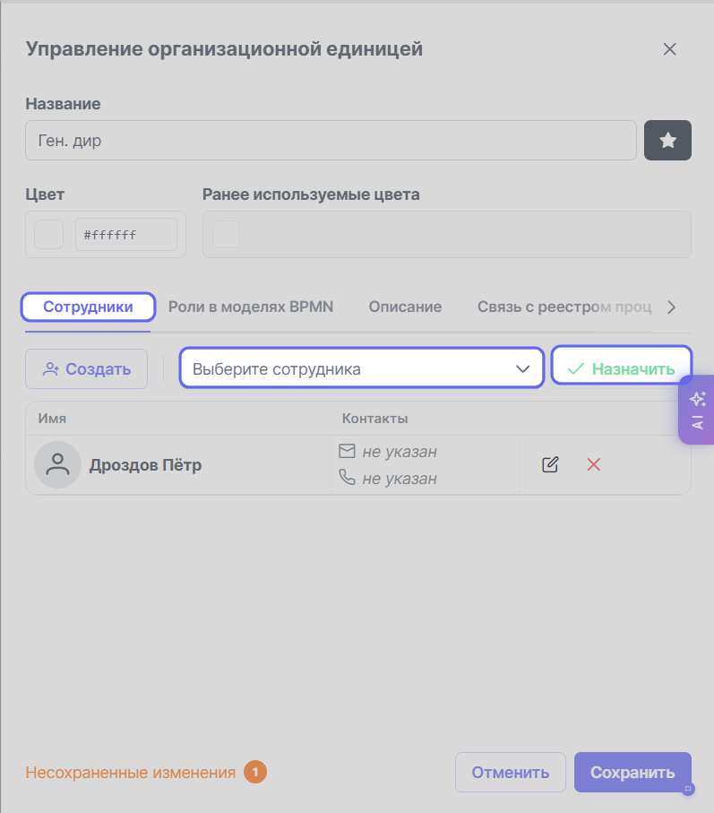

1. Сохраните изменения в карточке узла нажатием на кнопку **Сохранить**.

Напомним, что один сотрудник может занимать несколько должностей. Так же, как на одну должность можно назначить несколько сотрудников. Например, один и тот же человек может быть и директором, и начальником отдела.

## Привязка ролей к организационной структуре

**Роль** — это исполнитель конкретной задачи, а не должность. Одна роль может подходить для нескольких должностей: например, "Инициатор закупки товаров" может быть офис-менеджер или бухгалтер. Роли управляются через раздел {{ team.icon }} {{ universal.right_arrow }} {{ team.roles.icon }}. Подробнее о том, что такое **Роль** и как она работает читайте в разделе [FAQ](../../main/faq/index.md), [Роли](../../main/faq/index.md#roles).

Для привязки **Роли** к узлу организационной структуры выполните следующие шаги:  

1. Кликните по карточке на диаграмме, выберите {{ org.edit_node }}:

    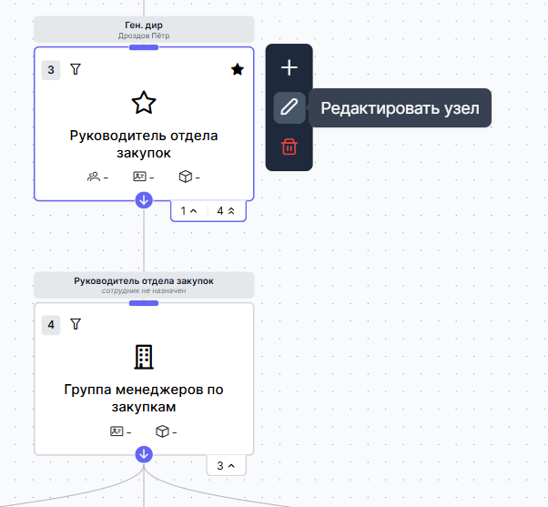

1. Перейдите в секцию **Роли в моделях BPMN** и выберите нужную вам роль из выпадающего списка:

    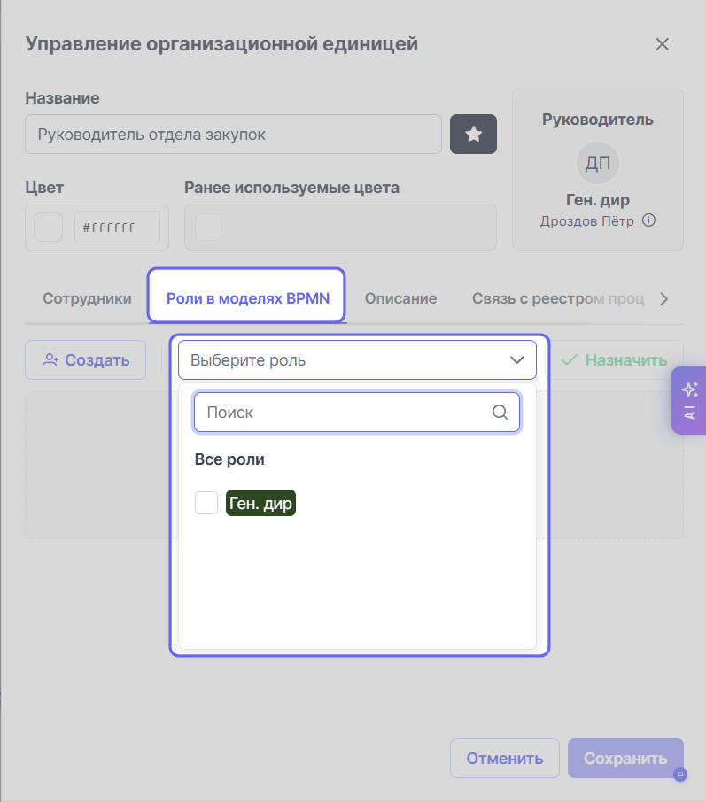

1. Нажмите на кнопку **Назначить** и потом на кнопку **Сохранить**.

## Дополнительные материалы

**[Презентация](https://www.youtube.com/watch?v=LN8LTrSjckQ&t=3586)** функционаности Оргструктуры на вебинаре:

<iframe width="560" height="315" src="https://www.youtube.com/embed/LN8LTrSjckQ?si=k9uRxRYqE57GCpSi&amp;start=3587" title="YouTube video player" frameborder="0" allow="accelerometer; autoplay; clipboard-write; encrypted-media; gyroscope; picture-in-picture; web-share" referrerpolicy="strict-origin-when-cross-origin" allowfullscreen></iframe>

**[Видео](https://youtu.be/o1Gx5N17xWQ)** с примером, как изменить подчиненность в оргструктуре:

- Передать группу (отдел, подразделение) в подчинение другому руководителю.
- Передать должность в другую группу (отдел, подразделение).

<iframe width="560" height="315" src="https://www.youtube.com/embed/o1Gx5N17xWQ?si=So-L9Sbkfu5L0utR" title="YouTube video player" frameborder="0" allow="accelerometer; autoplay; clipboard-write; encrypted-media; gyroscope; picture-in-picture; web-share" referrerpolicy="strict-origin-when-cross-origin" allowfullscreen></iframe>