# {{ page.meta.title }}

**Бизнес-процесс** — это последовательность действий исполнителей или систем, которая приводит к измеримому результату. Хорошо описанный бизнес-процесс обычно включает понятные шаги или подпроцессы, исполнителей, показатели эффективности, регламенты и документы, а также модель, отражающую логику его выполнения.

Единого стандарта описания бизнес-процессов нет. Компании по-разному фиксируют текстовое описание процессов, их связи, статусы, показатели и графическое представление в виде диаграмм. В {{ product_name }} для этого используется реестр процессов в разделе {{ team.bp_reg.icon }}.

## Создание бизнес-процессов в разделе Дерево/Каталог

Перейдите в раздел {{ team.bp_reg.icon }} {{ universal.right_arrow }} {{ team.bp_reg.bp_tree }}. У реестра процессов есть два основных представления:

- {{ bp_tree.tree }} — дерево процессов, в котором задается иерархия: какой процесс является верхнеуровневым, а какой подчиненным.
- {{ bp_tree.catalog }} — каталог процессов, в котором карточки процессов раскладываются по папкам для удобной навигации. В отличие от дерева, один и тот же процесс можно использовать в разных разделах каталога без дублирования карточки.

По умолчанию при входе в раздел {{ team.bp_reg.bp_tree }} открывается вкладка {{ bp_tree.tree }}, в которой обычно и начинают создание процесса:

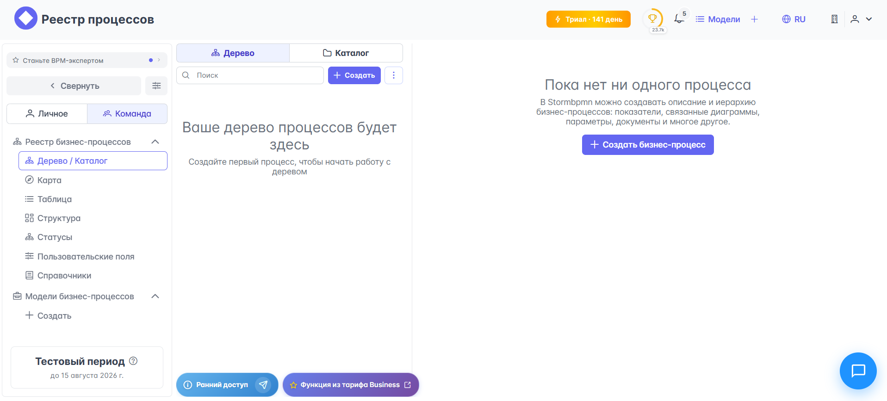

Сначала полезно продумать структуру процесса: какие у него есть этапы, подпроцессы, связи и логика выполнения. После этого его можно оформить в виде карточки процесса в реестре. 

!!! note "Зависимость от {{ org_structure.name }}"
    
    Перед созданием бизнес-процесса убедитесь, что в {{ team.icon }} уже настроена {{ org_structure.name }}: владелец процесса выбирается именно из нее.

### Создание верхнеуровневого бизнес-процесса

Для создания нового бизнес-процесса нажмите кнопку {{ bp_tree.create_bp }}. Откроется модальное окно **Создание бизнес-процесса**, в котором нужно заполнить следующие поля:

- **Название** (обязательно) — название бизнес-процесса, которое будет отображаться в дереве и в карточке процесса.
- **Родительский бизнес-процесс** (опционально) — процесс, для которого текущий процесс станет дочерним. Если вы создаете верхнеуровневый процесс, оставьте это поле пустым.
- **Описание** (опционально) — текстовое описание процесса: цель, условия выполнения, комментарии, особенности или общий контекст.
- **Владелец** (обязательно) — группа или должность из оргструктуры, которая отвечает за процесс.
- **Переиспользуемый процесс** — опция, которая позволяет включать текущий процесс в другие процессы как переиспользуемый. Это удобно для типовых и повторяющихся процессов, которые встречаются в нескольких сценариях.
- **Связанные модели BPMN** — BPMN-модели, относящиеся к данному процессу. У одной карточки процесса может быть несколько моделей, например текущая, архивная и целевая TO-BE-версия.

Если при создании карточки не выбрать диаграмму, система может автоматически создать пустую BPMN-модель-заглушку для поддержания связности процесса и модели.

Например, создадим процесс заключения договора с новым клиентом. Это может выглядеть так:

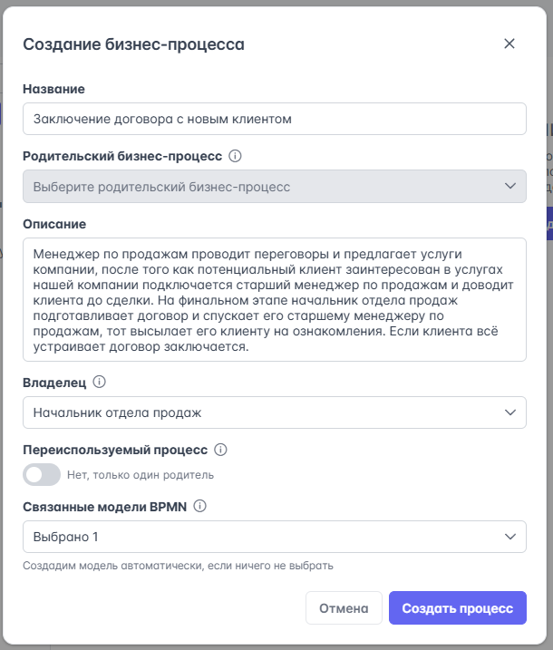

- **Название**: Заключение договора с новым клиентом
- **Родительский бизнес-процесс**: родительского процесса нет, потому что мы создаем верхнеуровневый процесс.
- **Описание**: Менеджер по продажам проводит переговоры и предлагает услуги компании. После того как потенциальный клиент заинтересован в услугах компании, подключается старший менеджер по продажам и доводит клиента до сделки. На финальном этапе начальник отдела продаж подготавливает договор и передает его старшему менеджеру по продажам, а тот отправляет документ клиенту на ознакомление. Если клиента все устраивает, договор заключается.
- **Владелец**: Начальник отдела продаж.
- **Переиспользуемый процесс**: нет, процесс уникальный и принадлежит только отделу продаж.
- **Связанные модели BPMN**: если диаграмма процесса уже есть, ее можно сразу привязать к карточке. Если диаграммы еще нет, поле можно временно оставить пустым. В нашем примере модель уже создана.

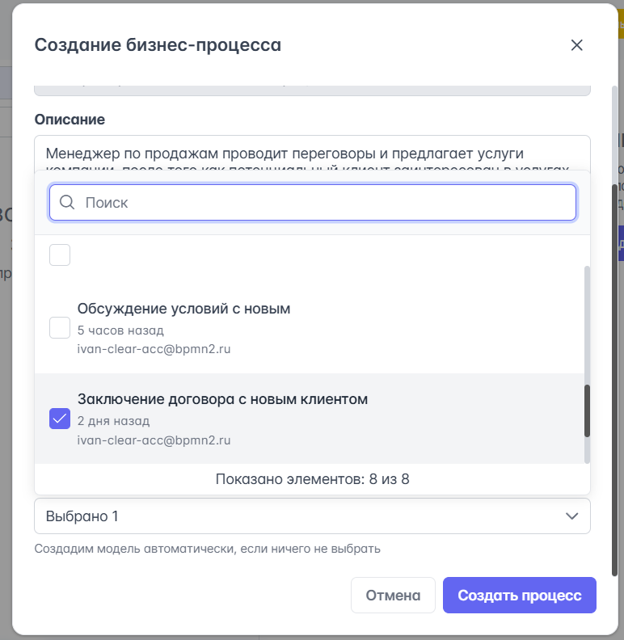

### Создание/добавление дочернего процесса

После создания процесса верхнего уровня, можно добавить дочерние процессы. Сделать это можно так:

1. Кликните на {{ universal.show_more }} справа от названия бизнес-процесса и выберите {{ bp_tree.create_sub_process }}:

    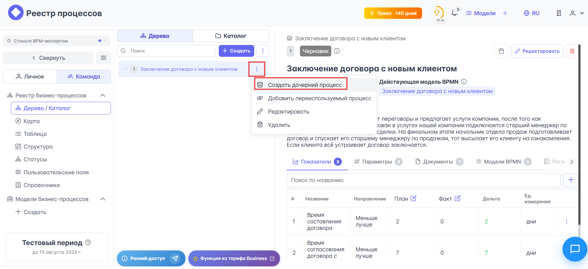

1. Откроется модальное окно **Создание бизнес-процесса** — поля в нем заполняются так же, как и при создании бизнес-процесса верхнего уровня.

После добавления дочерних процессов иерархия может выглядеть так:

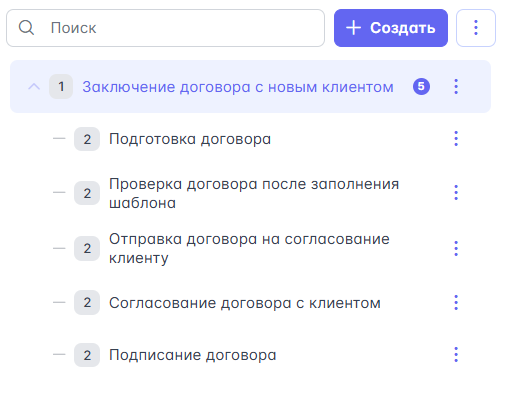

Каждому процессу вне зависимости от вложенности соответствует своя карточка процесса со своими свойствами и привязкой к BPMN-диаграмме. Вложенность и порядок дочерних процессов можно менять перетаскиванием их мышью.

### Переиспользование процессов

!!! note "Предварительная активация опции переиспользования процесса"

    Чтобы процесс можно было переиспользовать, нужно разрешить эту опцию в свойствах процесса: {{ universal.show_more }} справа от названия процесса {{ universal.right_arrow }} {{ bp_tree.edit }} {{ universal.right_arrow }} активировать тумблер **Переиспользуемый процесс**:

    

Часто бывает, что разные процессы содержат логически одинаковые подпроцессы. В таком случае удобно переиспользовать процессы, а не создавать их снова. Вот как это можно сделать:

1. Выберите процесс, в который хотите включить переиспользуемый подпроцесс, нажмите на {{ universal.show_more }} справа от названия процесса и из выпадающего списка выберите пункт {{ bp_tree.link_process }}:

    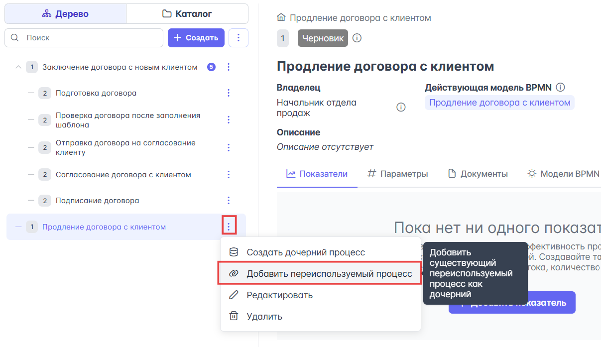

1. В открывшемся модальном окне **Добавить переиспользуемый процесс** выберите из выпадающего списка **Выберите процесс** нужный вам процесс:

    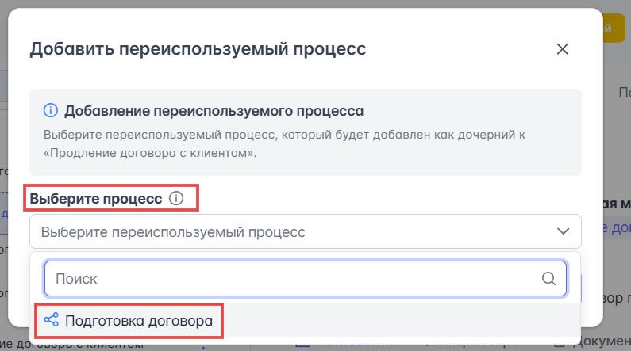

1. Нажмите кнопку **Добавить**.

Переиспользуемый процесс будет включен в новую иерархию:

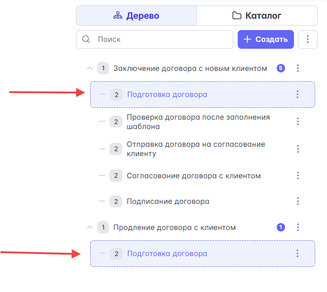

!!! note "Прямая и обратная зависимость свойств переиспользуемых процессов"

    У переиспользуемых процессов есть прямая и обратная связь свойств. Если вы добавите любое свойство к переиспользуемому процессу, оно будет распространено на исходный процесс, и наоборот.

## Карточка процесса

После создания процесса в правой части экрана появится карточка процесса:

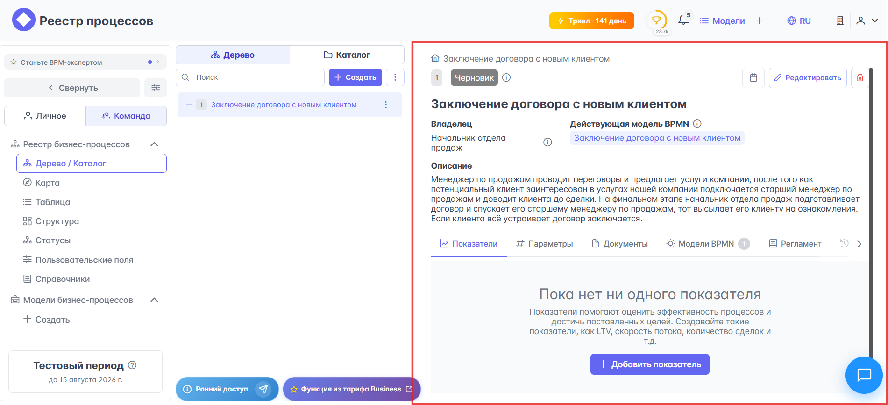

Разберем интерфейс карточки процесса подробнее:

- Верхний тулбар карточки процесса включает:

    - Уровень вложенности процесса. Самый верхний уровень — 1.
    - Статус бизнес-процесса. По умолчанию новая карточка создается в статусе «Черновик», но в системе можно настроить собственные статусы.
    - Даты создания и обновления карточки процесса.
    - Инструменты редактирования и удаления карточки процесса.

    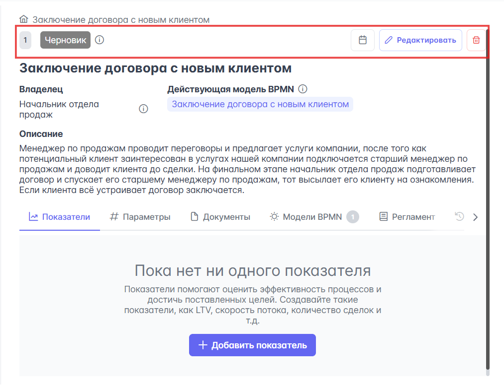

- Тело карточки процесса, которое включает название процесса, владельца, связанные BPMN-модели и описание.

    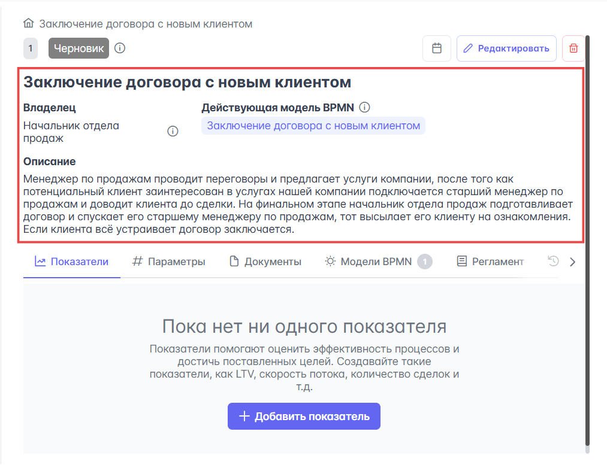

- Нижнее меню карточки бизнес-процесса, в котором доступны вкладки {{ bp_tree.metrics }}, {{ bp_tree.options }}, {{ bp_tree.documents }}, {{ bp_tree.bpmn_models }}, {{ bp_tree.reglament }}, {{ bp_tree.log }}.

    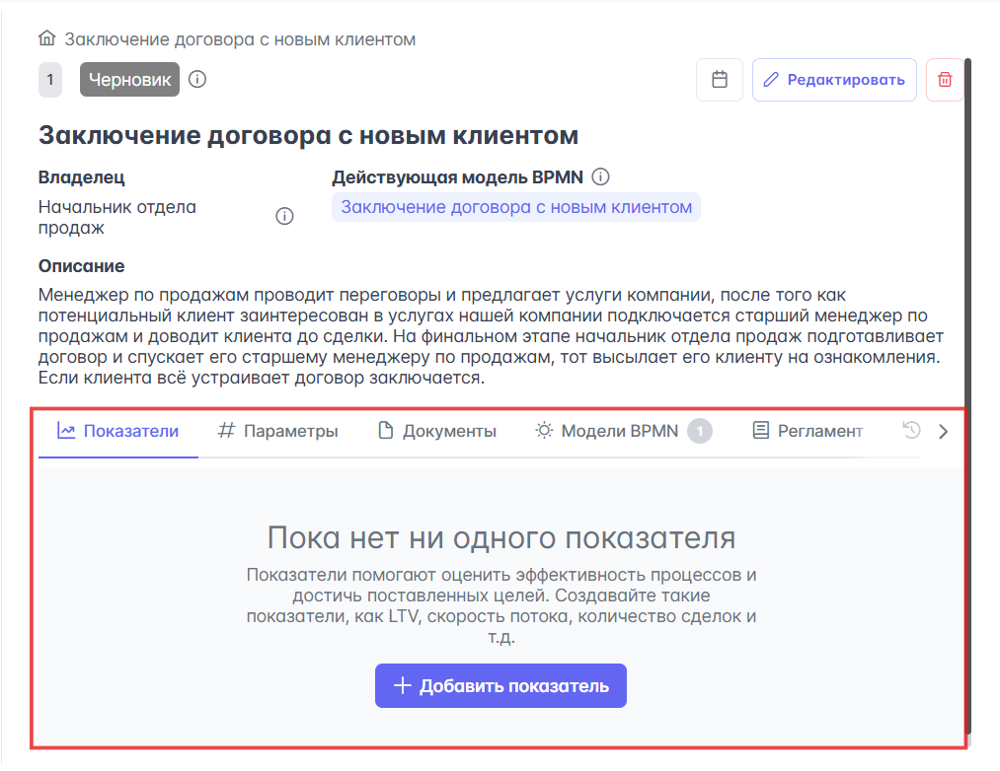

Бизнес-процесс может содержать не только базовое описание, но и набор дополнительных данных для управления, анализа и сопровождения. Рассмотрим эти вкладки подробнее.

### Вкладки карточки процесса

Вкладки карточки процесса нужны для сбора и отслеживания данных, по которым можно анализировать состояние процесса, поддерживать его в актуальном виде и принимать решения по улучшению. Вот что находится в каждой из них:

- {{ bp_tree.metrics }} — вкладка с показателями процесса. Здесь можно добавлять, искать, редактировать и удалять метрики, по которым оценивается эффективность процесса: длительность, стоимость, количество ошибок, конверсия, LTV, скорость потока, число сделок. Эти показатели помогают сравнивать состояние процесса в разные периоды и находить узкие места.

    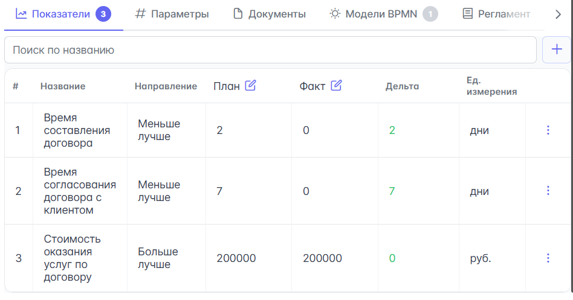

- {{ bp_tree.options }} — вкладка с параметрами процесса. Она нужна для хранения пользовательских атрибутов и контекста процесса: уровень риска, приоритет, критичность, продукт, проект, плановая дата запуска. Параметры можно создавать, выбирать из ранее созданных и редактировать, чтобы адаптировать карточки процессов под специфику вашей компании.

    

- {{ bp_tree.documents }} — вкладка с документами процесса. Здесь удобно хранить входные, внутренние и выходные документы, связанные с процессом: регламенты, инструкции, положения, методики, шаблоны, формы и подтверждающие файлы. Это помогает сохранить в одном месте не только схему, но и ее документальный контекст.

    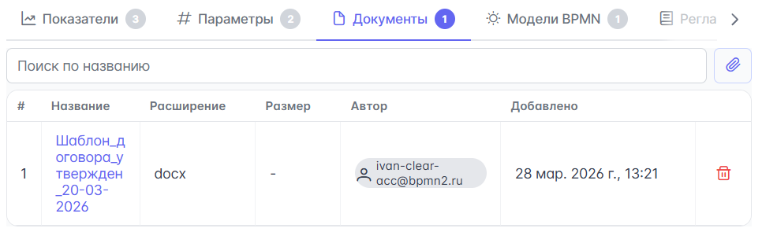

- {{ bp_tree.bpmn_models }} — вкладка со связанными BPMN-моделями. Одна карточка процесса может быть связана сразу с несколькими диаграммами, например с текущей моделью, архивной версией или целевой TO-BE-схемой. Это позволяет вести процесс как единую сущность, даже если его графическое описание меняется со временем.

    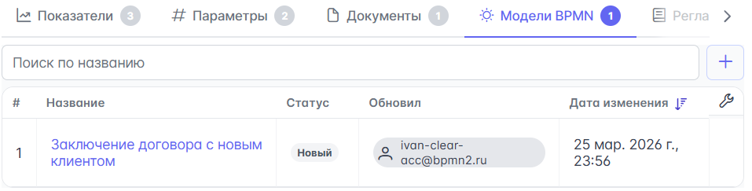

- {{ bp_tree.reglament }} — вкладка для формирования регламента процесса. Она собирает сведения из карточки процесса и связанных моделей, чтобы выгрузить их в текстовый регламент в формате `.DOCX`.

    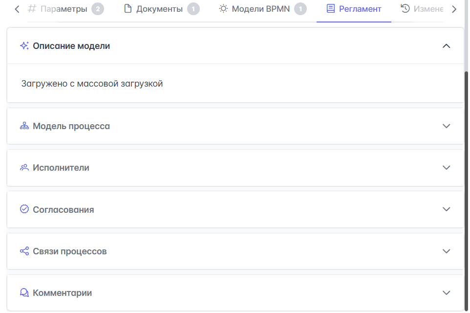

- {{ bp_tree.log }} — вкладка с историей изменений карточки процесса. Помогает отследить, какие параметры, показатели или состояния процесса менялись с течением времени.

    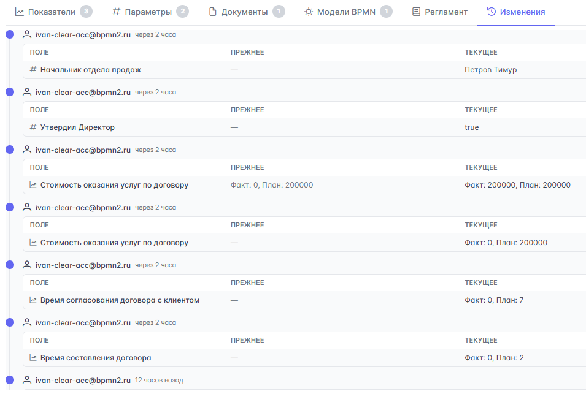

Добавление параметров, показателей и документов к карточке процесса не просто делает описание полнее. Оно помогает превратить процесс в рабочий управленческий объект: понятный для исполнителей, прозрачный для владельца и удобный для анализа, улучшения и регламентации.

## Работа с каталогом бизнес-процессов

{{ bp_tree.catalog }} — это удобная форма организации бизнес-процессов по папкам. Каталог удобно использовать тогда, когда у вас есть много ветвистых бизнес-процессов и их можно логически объединить в одну папку. Например, можно поместить в папку два логически близких бизнес-процесса, связанных с работой с клиентом:

1. Перейдите в {{ bp_tree.catalog }} и нажмите кнопку {{ bp_tree.create_bp }}.
1. В открывшемся модальном окне **Добавить папку** заполните следующие поля:

    - **Название папки** — задайте название папки, которая будет содержать близкие по логике бизнес-процессы.
    - **Родительская папка** — укажите родительскую папку, если хотите включить создаваемую папку внутрь другой папки. Оставьте поле пустым, чтобы создать верхнеуровневую папку.

    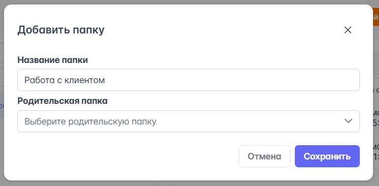

1. Нажмите кнопку **Сохранить**.

После создания папки в нее можно добавлять бизнес-процессы. Для этого кликните на {{ universal.show_more }} справа от названия папки и выберите {{ bp_tree.add_process_to_folder }} из выпадающего списка:

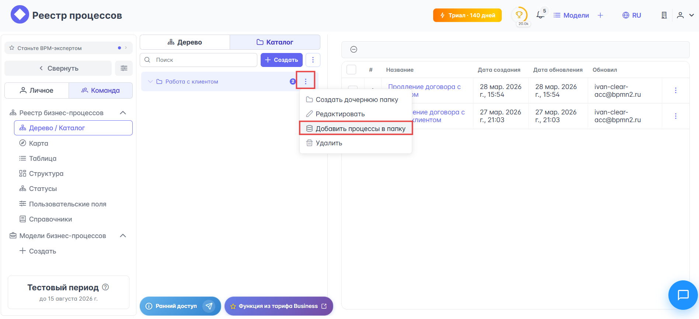

Теперь из списка можно выбрать процессы, которые вы хотите поместить в папку:

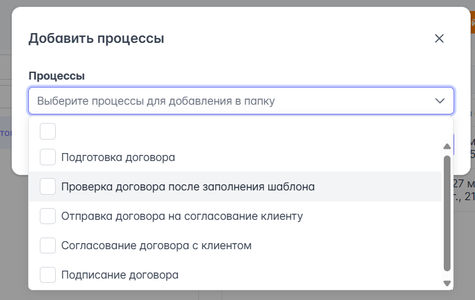

После добавления бизнес-процессов в папку они будут отображаться списком внутри папки и таблицей слева, где указаны название процесса, дата и время создания и обновления, а также информация о том, кто его создал или обновил:

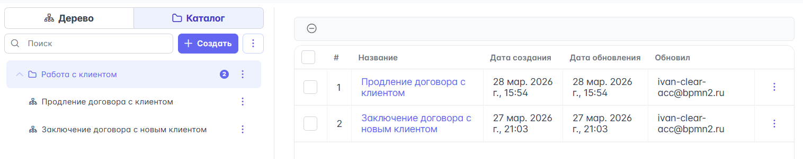