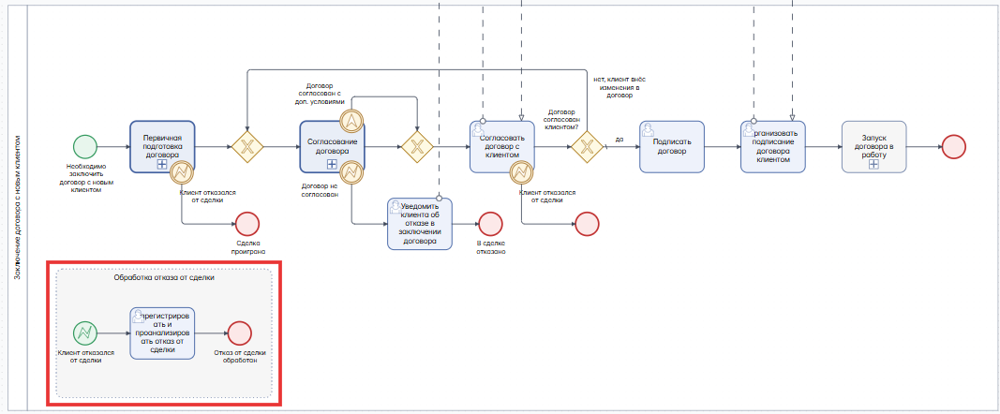
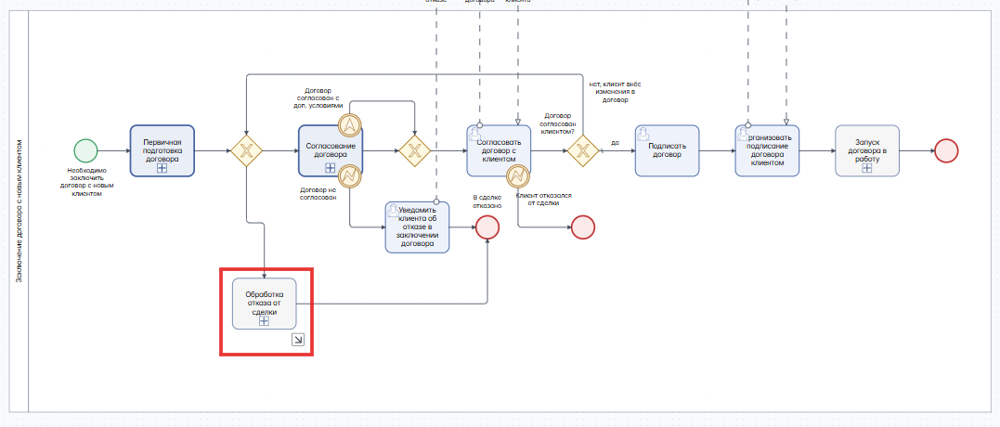
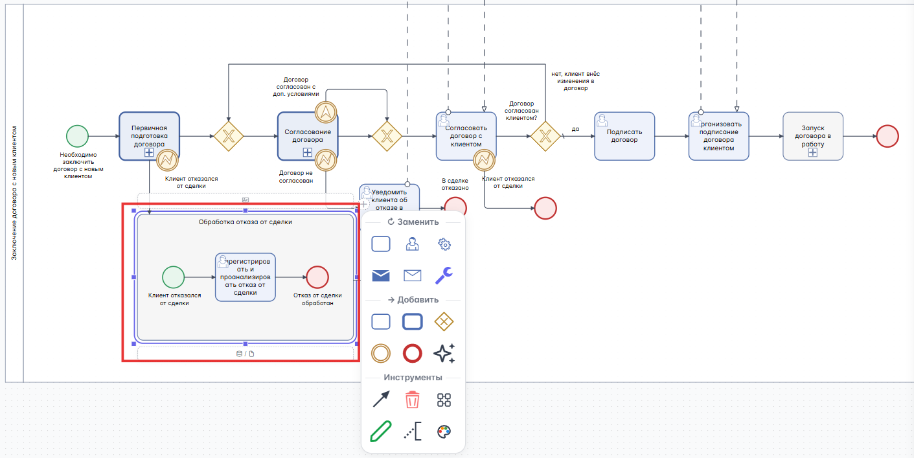
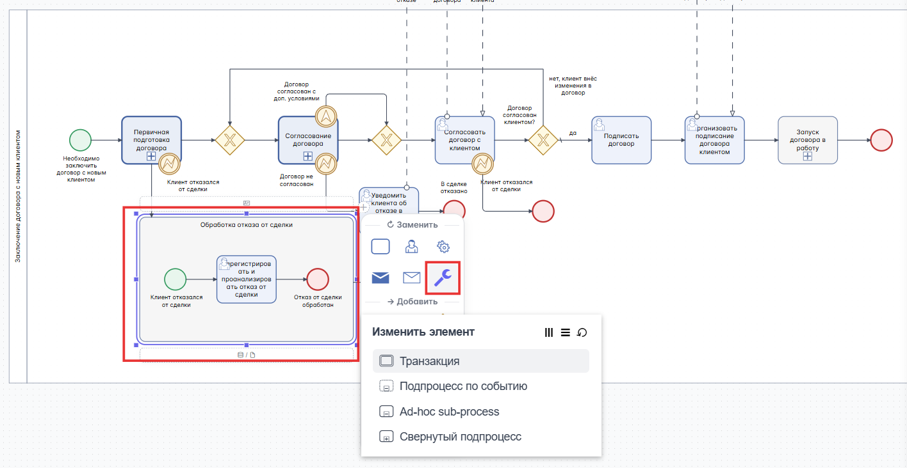
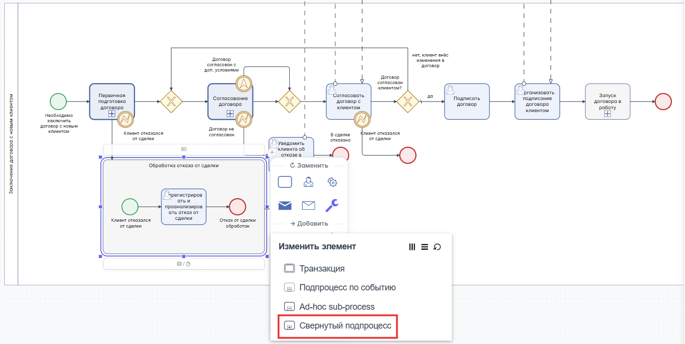
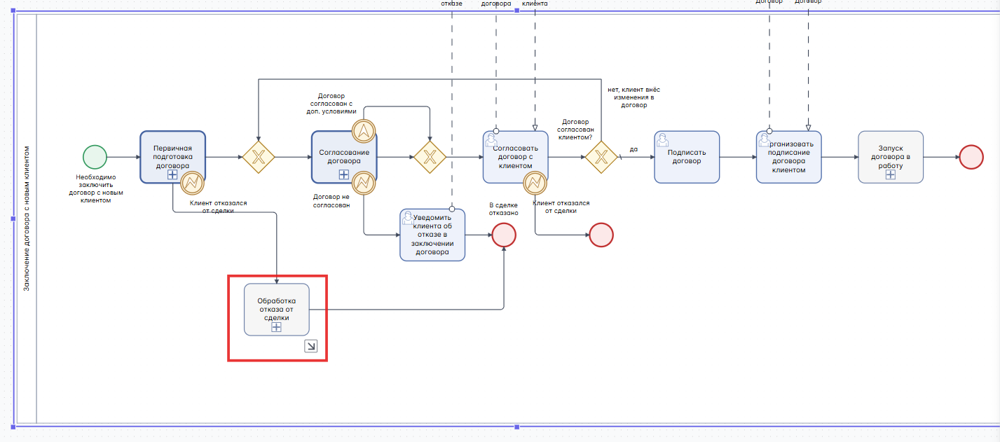
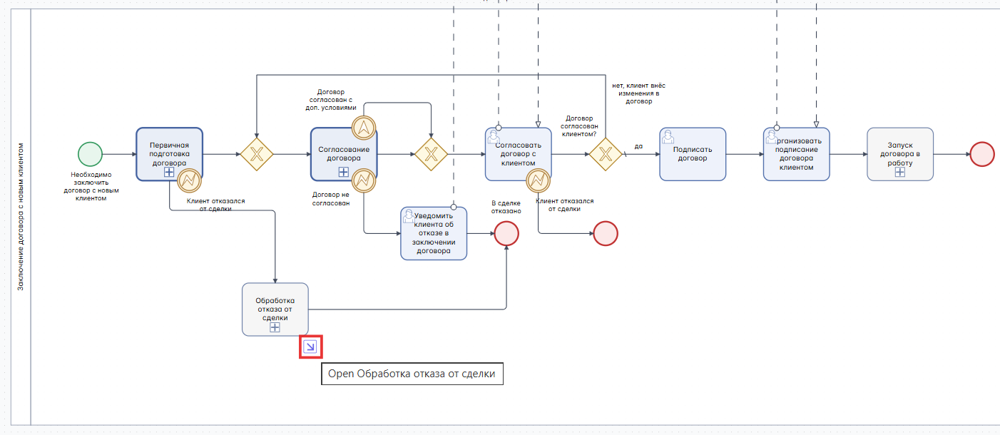

# Свернутый подпроцесс

Подпроцесс - это действие, которое может включать в себя другие действия, при этом уровень детализации может быть любым. Подпроцессы могут содержать неограниченное количество задач и других подпроцессов. По форме отображения на BPMN-схеме подпроцесс может быть **свёрнутым** или **развёрнутым**.

**Развернутый подпроцесс** отображается на BPMN-схеме как контейнер с уже раскрытым внутренним содержимым: внутри него видны задачи, события, развилки и потоки переходов. Такой формат используют, когда важно показать логику выполнения подпроцесса прямо на основной схеме и сделать ее понятной без перехода на отдельный уровень детализации:

**Свернутый подпроцесс** отображается на BPMN-схеме как единый элемент (обычно с маркером `+`), без показа внутренних шагов. Детальная логика при этом выносится на отдельную диаграмму или в другой раздел документации. Такой способ помогает не перегружать основную схему и сохранять ее читаемость, когда внутренние шаги подпроцесса не критичны для общего понимания процесса:

## Создание свёрнутого подпроцесса

Создать свёрнутый подпроцесс можно из развёрнутого подпроцесса:

- Выберите развёрнутый подпроцесс:
    
- Кликните по {{ universal.wrench }} **Изменить элемент** в появившемся окне опций:
    
- Выберите пункт {{ bpmn.subprocess_collapsed }}:
    

После нажатия на {{ bpmn.subprocess_collapsed }} будет создан **Свернутый подпроцесс**:

Также **Свернутый подпроцесс** можно создать из элемента {{ bpmn.task }} — следуйте инструкции выше.  
Для перехода внутрь свёрнутого подпроцесса кликните по иконке "стрелка" открытия окна — откроется диаграмма свёрнутого подпроцесса:

## Дополнительные материалы

В видео подробно показали, как создавать и настраивать свёрнутый подпроцесс (Collapsed Subprocess): добавление элемента на диаграмму, изменение типа (из Task в Subprocess), работу с маркером «+», внутреннюю модель процесса, переключение между свёрнутым и развёрнутым видом.

<iframe width="560" height="315" src="https://www.youtube.com/embed/xWAEAfLwFJ8?si=-kDP4ABkL_e_TgKZ" title="YouTube video player" frameborder="0" allow="accelerometer; autoplay; clipboard-write; encrypted-media; gyroscope; picture-in-picture; web-share" referrerpolicy="strict-origin-when-cross-origin" allowfullscreen></iframe>