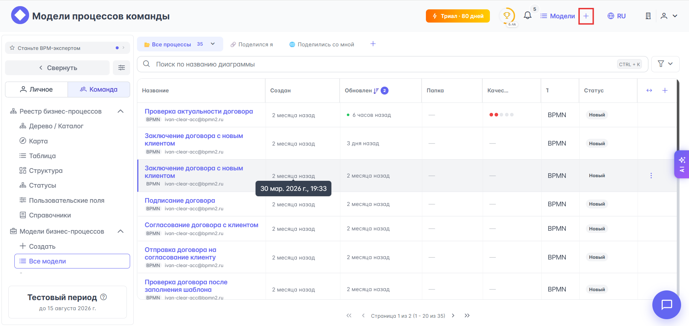
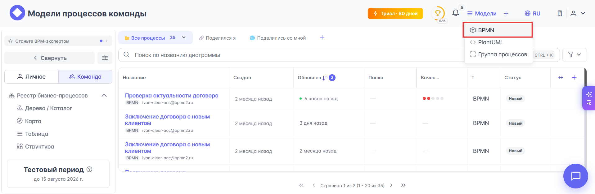
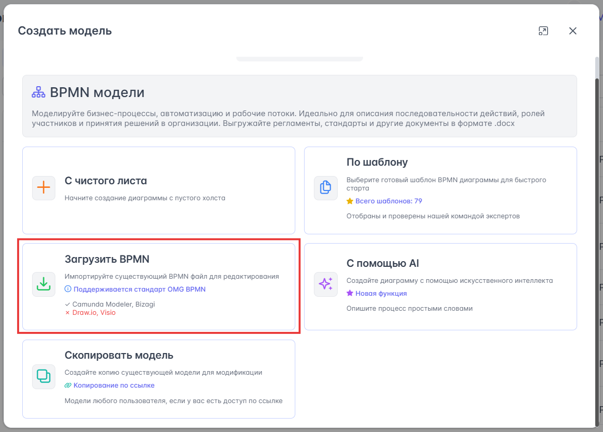
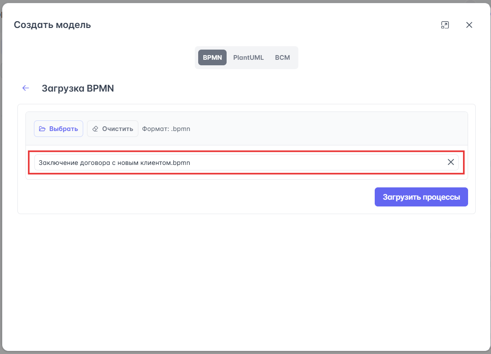
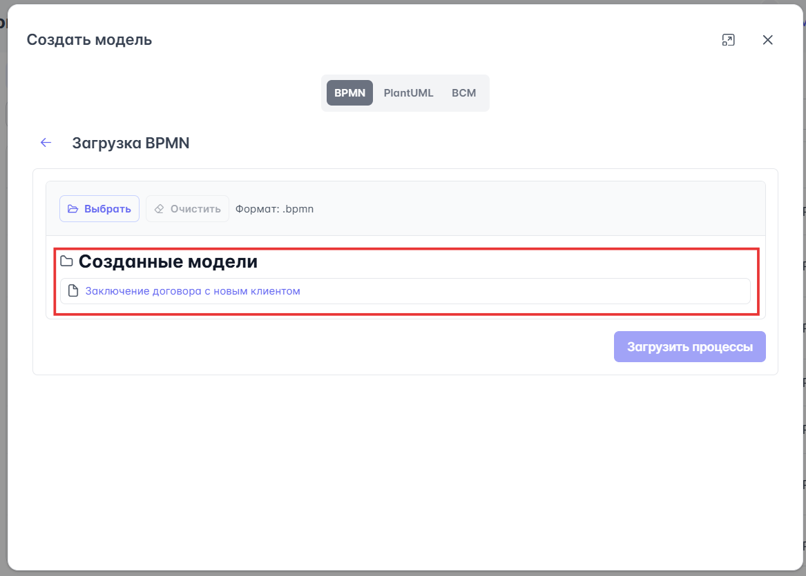
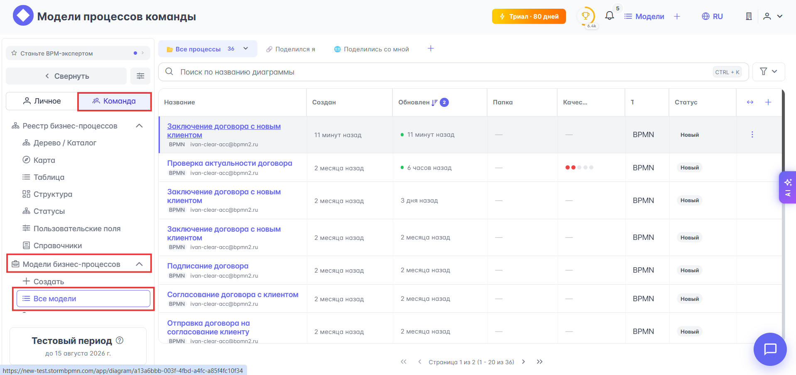

# Загрузка/импорт BPMN-моделей

{{ product_name }} позволяет загружать BPMN-модели стандартов OMG BPMN, Camunda Modeler, Bizagi. Для загрузки BPMN-моделей:

1. Нажмите на кнопку {{ universal.plus }} на верхней панели инструментов {{ product_name }}:
    
1. Выберите <i class="pi pi-box"></i> **BPMN** из выпадающего списка:
    
1. Выберите вариант **Загрузка BPMN** из доступных вариантов создания BPMN-моделей:
    
1. Выберите BPMN-модель для загрузки с локального компьютера и нажмите кнопку **Загрузить процессы**:
    
1. После успешной загрузки модели в текущем окне появится секция **Созданные модели** со ссылкой на загруженную модель:
    

BPMN-модель будет загружена в раздел {{ section_team.buttons.team_switcher }} {{ universal.right_arrow }} {{ bs_models.bs_m }} {{ universal.right_arrow }} {{ bs_models.models_list }}:

