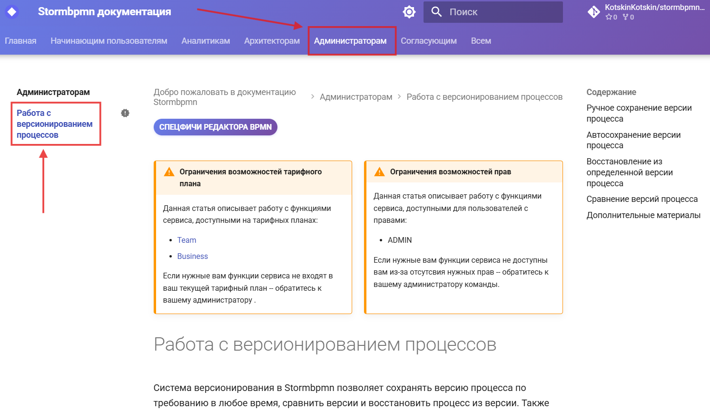

# {{ page.meta.title }}

Документация построена по принципу перекрестия двух навигационных панелей: верхней горизонтальной панели навигации, которая содержит аудитории, и левой боковой панели, которая содержит конкретные сценарии использования функций {{ product_name }}.

Целевые аудитории верхней панели навигации и описание материалов, которые в них содержатся:


    {# пропускаем первый элемент #}
* **{{ item.title }}** — 
  {{ (s[0]|lower + s[1:]) if s else "(описание отсутствует)" }}
  


В левой панели навигации находятся конкретные сценарии работы с {{ product_name }}. Например, статья «Работа с версионированием процессов» описывает сценарий версионирования диаграммы, которым обычно занимаются администраторы:

Или вот другой пример: статья «Согласование процесса» описывает механизм согласования диаграммы и находится сразу в нескольких категориях: **Согласующие** и **Все**.

Так получается, что найти нужный вам сценарий очень просто — сначала нужно выбрать аудиторию в верхней панели навигации, а затем в левой панели найти нужный кейс. Если нет понимания, к какой аудитории относится искомый кейс, можно воспользоваться поиском.

## Преемственность документации

Новая документация поначалу может показаться неудобной и непривычной, потому что она построена по‑другому, не так, как старая документация {{ product_name }}. Чтобы пользователям, которые уже давно используют документацию {{ product_name }}, было легче сориентироваться в новой документации, мы мигрировали теги из старой документации и встроили их в поиск.

Теперь можно просто ввести нужный тег в поиск и получить список всех статей, соответствующих тегу.

## Важные уведомления в начале статей и разделов

В начале некоторых статей и разделов есть уведомления с важной информацией об ограничениях тарифного плана, ролей и прав доступа.

**Уведомление об ограничениях тарифного плана** предупреждает о том, что описанная в статье функциональность {{ product_name }} доступна только для определенного тарифного плана, например, для тарифного плана **Team** или **Business**, или для обоих тарифных планов.

**Уведомление об ограничениях роли** предупреждает о том, что описанная в статье функциональность {{ product_name }} доступна только для определенной роли или ролей, например, для роли **Администратор**.

**Уведомление об ограничениях прав** предупреждает о том, что описанная в статье функциональность {{ product_name }} доступна только для роли с определенном набором прав, например, для роли **Участник** с правами **чтение и запись**.