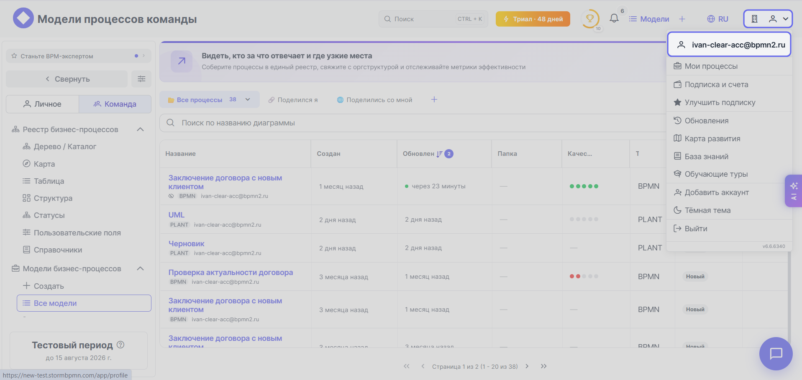
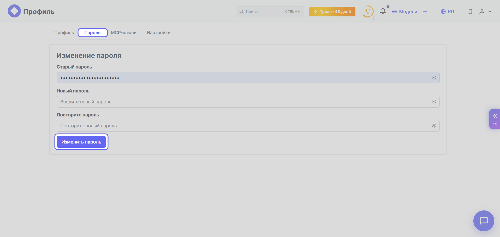

ℹ️🔽 "Смена пароля"
    
    Для смены пароля выполните следующие шаги:

    1. Кликните по значку {{ acc.main_button }} в правом верхнем углу экрана и выберите из выпадающего списка первый пункт — название вашего профиля:

        
    
    1. Перейдите во вкладку **Пароль** и смените пароль:

         