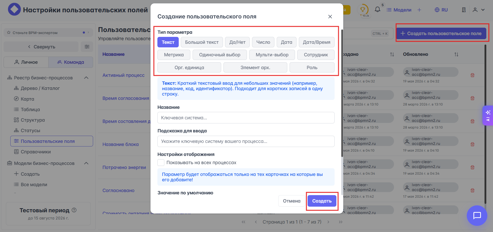

<h4 id="custom-fields">Пользовательские поля</h4>

ℹ️🔽 "Что такое {{ bp_reg.custom-fields }}?"

    {{ bp_reg.custom-fields }} — это перечень всех возможных атрибутов и параметров процесса, которые позволяют настроить реестр процессов в соответствии со спецификой отрасли или компании.

    Заданные в этом разделе поля будут отражаться в разделах {{ bp_tree.metrics }} и {{ bp_tree.options }} реестра бизнес-процессов.

ℹ️🔽 "Создание пользовательских полей"

    Все пользовательские поля, кроме **Метрика**, отражаются во вкладке {{ bp_tree.options }} бизнес-процесса. Для создания пользовательского поля кликните на кнопку {{ universal.plus }} **Создать пользовательское поле** и в открывшемся модальном окне выберите интересующий вас тип параметра:

    

ℹ️🔽 "Типы параметров"

    **Простые типы данных**

    * **Текст** — краткое текстовое описание для коротких значений (название, код, идентификатор). Подходит для коротких записей в одну строку.
    * **Большой текст** — многострочный текстовый ввод для длинных описаний, комментариев или заметок. Идеально подходит для детального описания или развернутых пояснений. Тип поля: текст.
    * **Да/Нет** — логический тип для булевых параметров. Удобен для бинарных признаков и флагов (например, "Обязательно", "Активно", "Утверждено").
    * **Число** — числовое значение для ввода количественных данных. Подходит для значений размера, количества, стоимости и других числовых метрик.
    * **Дата** — календарная дата без указания времени. Используется для указания сроков, дат начала или окончания событий (например, дата запуска процесса, дедлайн).
    * **Дата/Время** — дата и время для указания точного момента события. Необходимо, когда важна не только дата, но и время (например, время начала задачи, момент завершения этапа).

    **Исчисляемые и относительные единицы**

    * **Метрика** — показатель для измерения эффективности процесса. Требует указания направления изменения (больше лучше / меньше лучше) и единицы измерения (руб., %, дни и т.д.). Отражается во вкладке {{ bp_tree.metrics }} бизнес-процесса.
    
    **Выбор из заранее подготовленных справочников**

    * **Одиночный выбор** — позволяет выбрать одно значение из справочника. Справочник — это список заранее определенных значений. Например, справочник "Статус процесса" может содержать значения: "В разработке", "На согласовании", "Утвержден". Справочники могут содержать вложенные справочники для создания иерархической структуры данных.
    * **Мульти-выбор** — позволяет выбрать несколько значений из справочника одновременно. Полезно, когда параметр может иметь несколько вариантов ответа. Например, для параметра "Ответственные подразделения" можно выбрать несколько подразделений из справочника: "IT-отдел", "Финансовый отдел", "Отдел продаж".

    **Ссылки на заранее созданные объекты бизнес-процессов**

    * **Сотрудники** — ссылка на конкретного сотрудника в системе. Используйте этот тип, когда параметр должен хранить именно человека (например, куратор процесса).
    * **Элемент оргструктуры** — ссылка на подразделение или позицию в оргструктуре. Подходит, если нужно хранить организационную единицу (например, ответственное подразделение).
    * **Элемент архитектуры** — ссылка на архитектурный объект (систему, приложение и т.п.). Используйте, когда параметр описывает связанную систему или ИТ-актив.
    * **Роль (исполнитель)** — ссылка на роль исполнителя процесса/активности. Подходит для хранения ответственных ролей.

