# FAQ по Stormbpmn

Этот раздел содержит ответы на частые вопросы, которые возникают у пользователей {{ product_name }}.

## Редактор диаграмм

ℹ️🔽 "Изменить цвет элемента диаграммы"

    Кликните по элементу диаграммы, цвет которого хотите изменить, а затем кликните на кнопку {{ process_editor.upper_toolbar.buttons.choose_color }} в верхней панели управления и выберите желаемый цвет заливки элемента:

    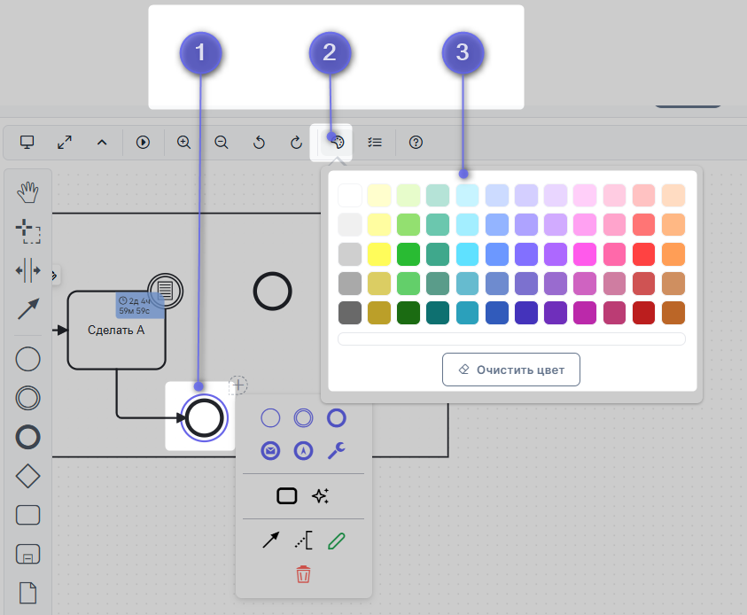

    Для изменения цвета заднего фона диаграммы — кликните по фону диаграммы и повторите действия, описанные выше.

ℹ️🔽 "Оставить комментарий к элементу диаграммы"

    Кликните по элементу диаграммы, справа вверху от элемента появится кнопка {{ process_editor.canvas.elements.add_notice }}. Кликните по кнопке и в появившееся поле введите комментарий. Поддерживается многострочный ввод и возможность прикрепить файл:

    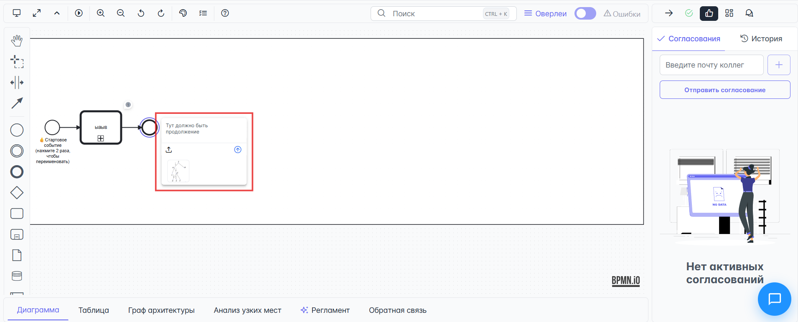

    Комментарии, оставленные на элементах, дублируются списком виджетов в правой панели управления в разделе {{ process_editor.right_toolbar.buttons.notices }}:

    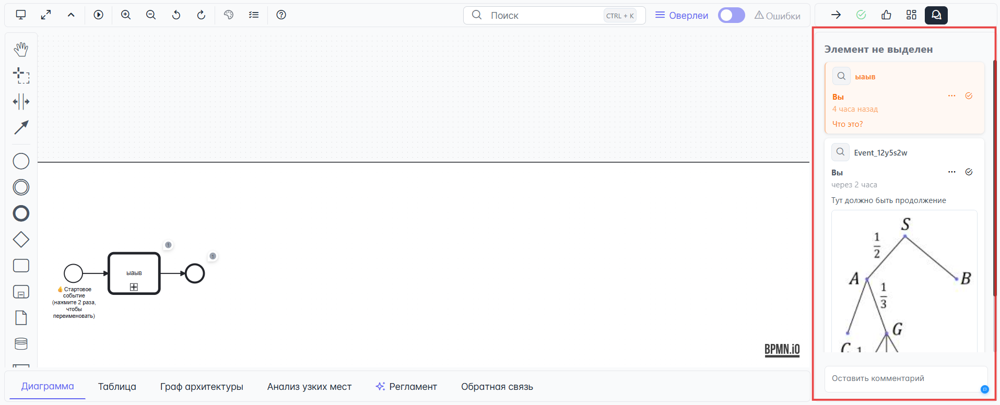

    Виджеты комментариев удобно отражают статус комментария, его важность, принадлежность к элементу на схеме:

    - Естественный цвет виджета комментария и чёрный цвет кнопки {{ process_editor.right_toolbar.buttons.notice_active }} свидетельствуют о том, что комментарий активен.
    - Приглушённый (бледный/затенённый) цвет виджета комментария и зелёный цвет кнопки {{ process_editor.right_toolbar.buttons.notice_active }} свидетельствуют о том, что комментарий решён.
    - Оранжевый цвет виджета комментария указывает на его важность. Изменить уровень важности комментария можно, кликнув по кнопке {{ process_editor.right_toolbar.buttons.extra }} в виджете и выбрав из выпадающего списка опцию: **Сделать важным** / **Отменить важность**.
    - Быстро перейти к элементу, к которому прикреплён комментарий, можно, кликнув по кнопке {{ process_editor.right_toolbar.buttons.search }} в левом верхнем углу виджета комментария.

ℹ️🔽 "Поток управления «в остальных случаях», поток по умолчанию"

    По правилам BPMN-нотации при использовании логической развилки один из выходных потоков должен быть отмечен как поток управления «в остальных случаях» (RU-версия). Для этого кликните на нужный выходной поток — откроется меню дополнительных настроек. Кликните по изображению гаечного ключа и выберите пункт: **Поток управления «в остальных случаях»**:

    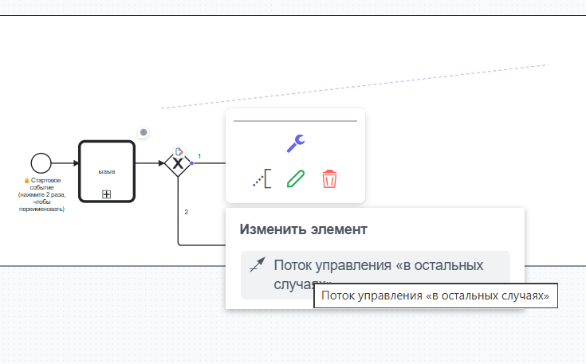

    {{ universal.youtube }} [видео](https://youtu.be/Qa6EVKrsn40) с примером.

ℹ️🔽 "Подпроцесс по событию"

    **Подпроцесс по событию** в BPMN 2.0 — это тип подпроцесса, запускаемого конкретным событием (сообщением, ошибкой, сигналом или таймером) во время выполнения родительского процесса, с возможностью прерывания или параллельного выполнения для обработки исключений и уведомлений.

    В {{ product_name }} **Подпроцесс по событию** — это опция изменения **Развёрнутого подпроцесса**. Чтобы создать **Подпроцесс по событию**, выполните следующие шаги:
    
    1. Перетащите на диаграмму из левой панели элементов элемент **Развёрнутый подпроцесс**:

        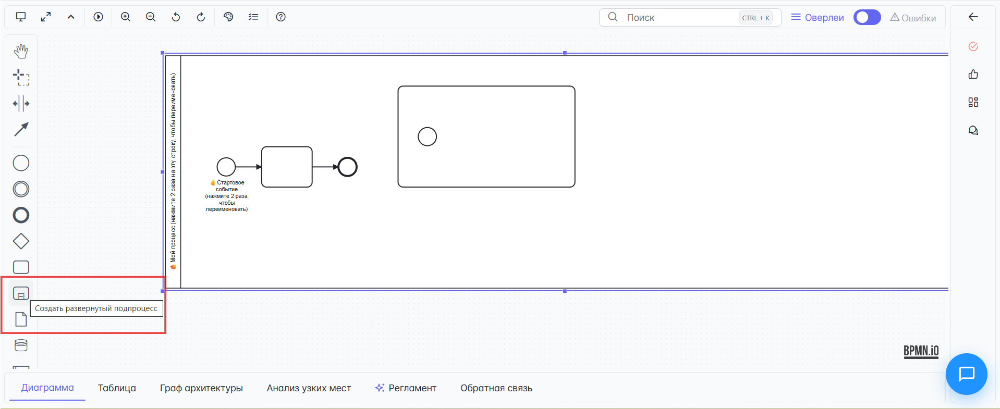

    2. Кликните по элементу **Развёрнутый подпроцесс** и из выпадающего меню выберите опцию {{ universal.wrench }} **Изменить элемент**:

        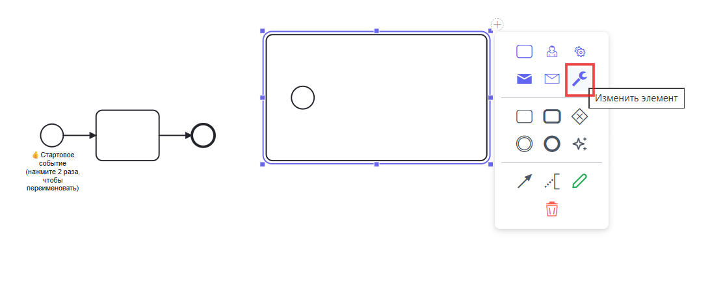  

    3. В меню дополнительных опций изменения процесса выберите пункт **Подпроцесс по событию**:

        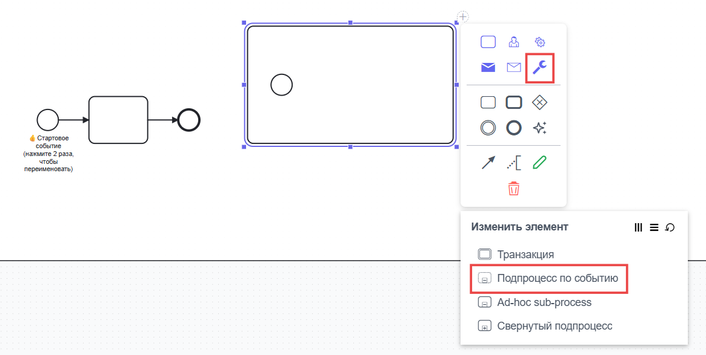

ℹ️🔽 "Назначить нескольким задачам одновременно одну роль и/или элемент архитектуры"

    1. В редакторе диаграмм кликните по {{ process_editor.right_toolbar.archetecture }} правого тулбара — откроется меню добавления ролей и элементов архитектуры к «активным» элементам диаграммы:

        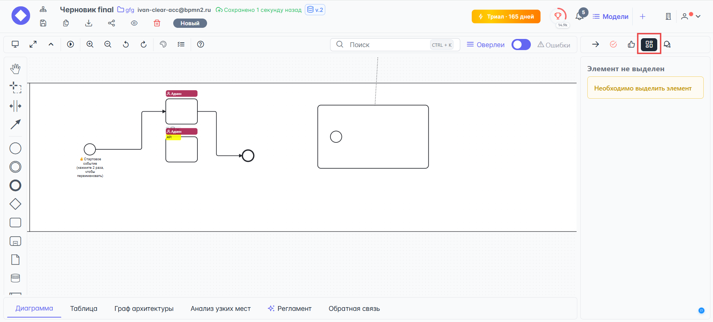  

    2. Кликните с зажатой клавишей Shift по элементам диаграммы, обозначающим процесс или действие, и выберите **Роль** и/или **Элемент архитектуры**, которые хотите присвоить выбранным элементам:

        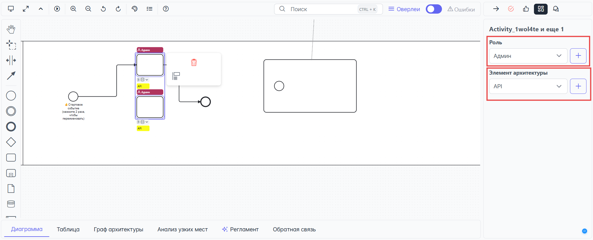
    
    Если у вас еще нет нужной роли или элемента архитектуры — вы можете их создать, нажав на кнопку {{ universal.plus }} справа от роли или элемента архитектуры.

## Интеграции {{ product_name }} с популярными платформами
🏷️ Confluence

ℹ️🔽 "Встроить диаграмму {{ product_name }} в документ облачной версии Confluence"

    1. Перейдите в окно **Редактор диаграмм** и нажмите на кнопку {{ process_editor.upper_toolbar.buttons.share }} в верхней панели инструментов:

        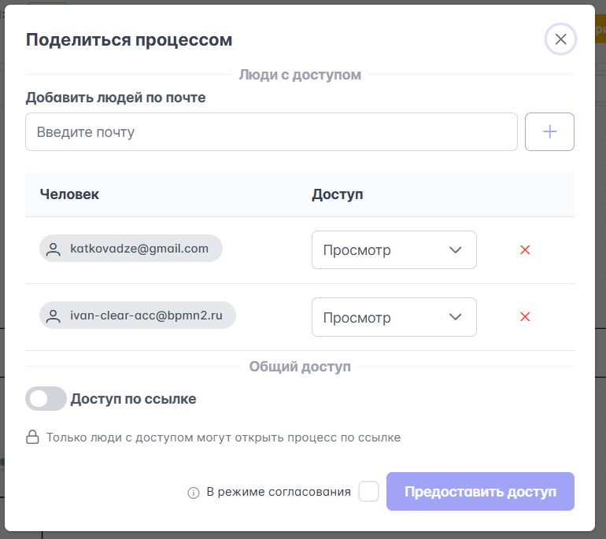

    2. Активируйте тумблер {{ universal.toggle }} **Доступ по ссылке** и кликните по кнопке {{ process_editor.upper_toolbar.buttons.embded_iframe }}:

        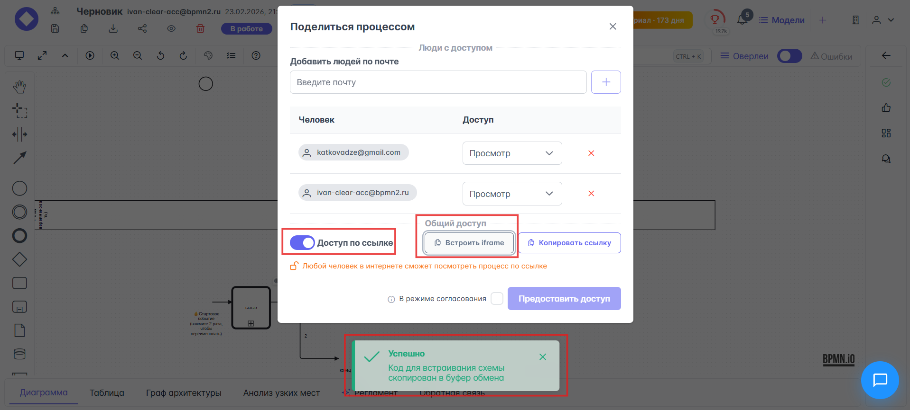

    В буфер обмена будет скопирован код iframe. Временно его можно вставить в любой текстовый редактор. Позже понадобится только сама ссылка.

    3. Перейдите в облачный редактор Confluence, откройте документ, в который хотите вставить диаграмму, и перейдите в режим редактирования.

    4. Установите курсор в нужную строку документа, кликните по {{ universal.plus }} слева от курсора и выберите последний пункт выпадающего списка <i class="fa-solid fa-ellipsis"></i> View more:

        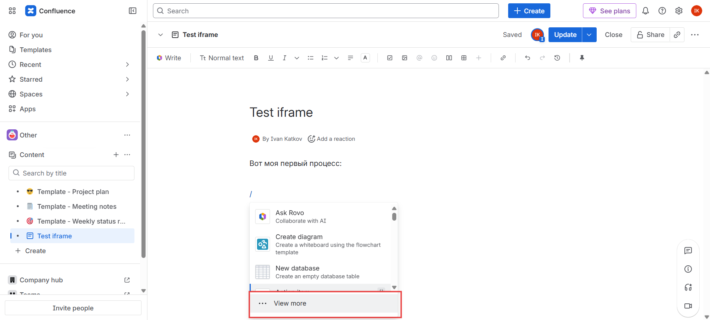
    
    5. Введите в поиск «iframe» и выберите блок **Iframe**:

        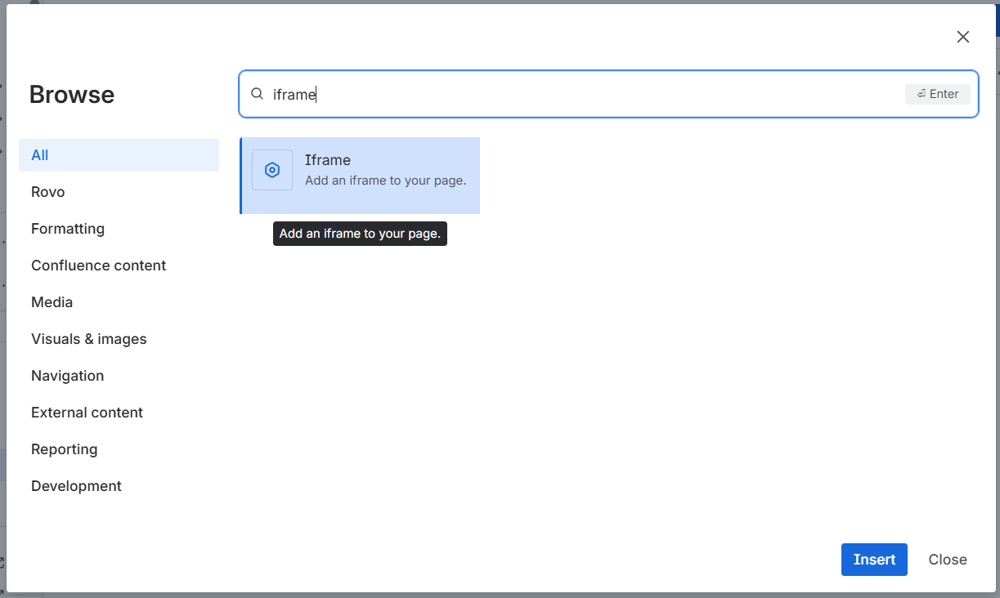
    
    6. В открывшемся окне настроек блока **Iframe** введите в поля справа следующие значения:

    - URL — укажите ссылку на iframe из скопированного кода (формата: `https://new-test.stormbpmn.com/app/diagram/bb7a69c1-e1a9-4140-8e98-e5aead2cb54b?overlays=...`).
    - Width — задайте 100%.
    - Height — по желанию.
    
    Остальные параметры опциональны.

## Работа с файлами и с рабочим пространством {{ product_name }}

ℹ️🔽 "Перемещение диаграмм между папками"

    При создании аккаунта автоматически создаётся команда и рабочее пространство команды с папкой по умолчанию {{ universal.folder }} **Others**, в которую по умолчанию сохраняются диаграммы, если не указана другая папка.

    ### Перемещение диаграммы между папками в разделе {{ section_team.buttons.team_switcher }}
    
    1. Для перемещения диаграммы после её сохранения без указания конкретной папки или для перемещения между папками перейдите в раздел {{ section_team.buttons.team_switcher }} → {{ section_team.layouts.business_models }} → {{ section_team.layouts.folders }}:

        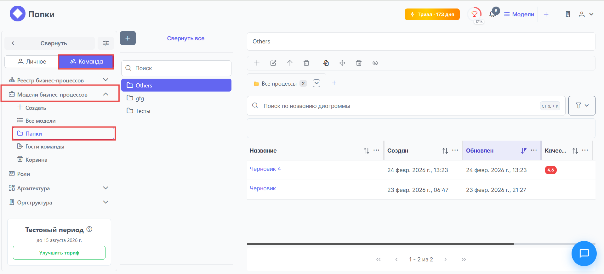

    2. Перейдите в папку, где сейчас находится диаграмма, которую нужно перенести, или в папку {{ universal.folder }} **Others**, если диаграмма была сохранена без указания папки.

    3. Кликните на строку с названием диаграммы (не кликайте по самому названию — это откроет диаграмму в режиме редактирования), затем кликните на кнопку {{ section_team.buttons.move_diagram }} в верхней панели инструментов:

        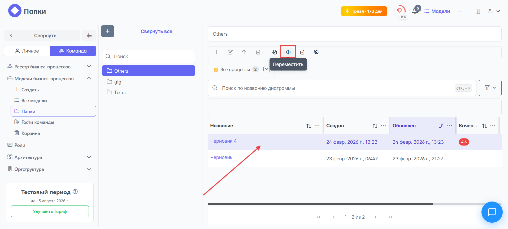

    4. В открывшемся модальном окне **Переместить процессы** выберите папку, в которую нужно перенести процессы, и нажмите кнопку **Переместить процессы**:

        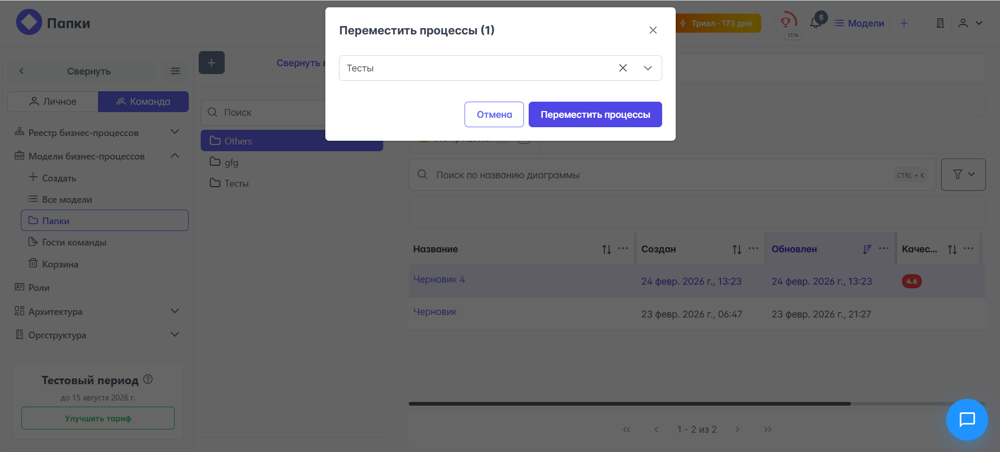

    Если нужно переместить несколько процессов — кликайте по строке каждого процесса, который требуется перенести. Выбор по строке работает в режиме мультивыбора.

    ### Перемещение диаграммы между папками в редакторе диаграмм

    1. Откройте диаграмму в редакторе и нажмите на кнопку {{ process_editor.upper_toolbar.buttons.save_as_version }} в верхней панели инструментов:

        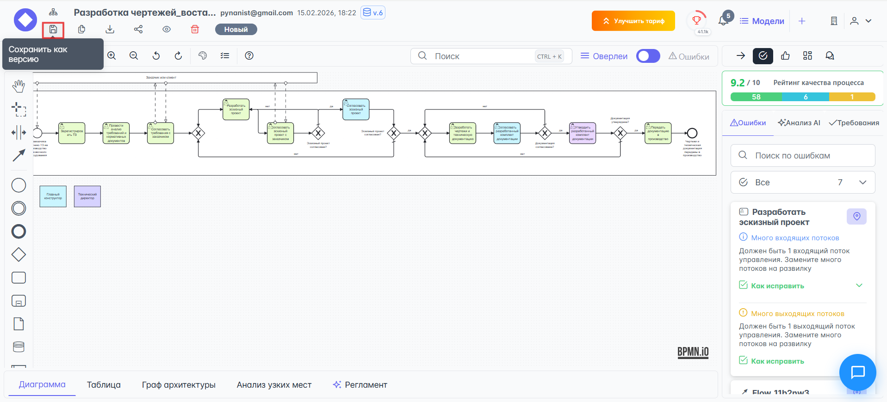

    2. В открывшемся модальном окне **Сохранение модели** из выпадающего списка **Название папки** выберите нужную папку и нажмите кнопку **Сохранить как версию**:

        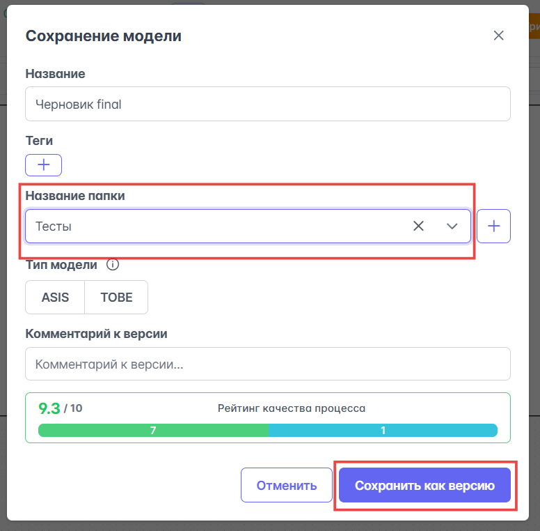

    Оба способа перемещения диаграммы показаны в {{ universal.youtube }} [видео-примере](https://youtu.be/3BtQGrzsH6g).

## Команда

### Роли

⚠️ "Ограничения прав и подписки"
    Создавать роли может только **администратор команды**. Роли — это часть платной подписки **TEAM** или **Enterprise**.

⚠️ "Поведение Ролей"
    Роли — это объекты команды, а не пользователя. При выходе из команды или переходе в другую команду роли удаляются с диаграмм, и их оверлеи на диаграммах пропадают (восстановление невозможно).

ℹ️🔽 "Общие сведения о ролях"

    **Роль** — это исполнитель конкретной задачи, а не должность. Одна роль может подходить для нескольких должностей: например, "Инициатор закупки товаров" может быть офис-менеджером, бухгалтером или завхозом. Наоборот, одна должность (как директор) может выполнять несколько ролей — от административных до юридических или бухгалтерских.

    Роли переиспользуемы и предпочтительнее дорожек для описания исполнителей.

ℹ️🔽 "Создание ролей"
    
    Роль можно создать в разделе {{ section_team.buttons.team_switcher }} {{ universal.right_arrow }}  {{ section_team.layouts.roles }}, нажав на кнопку {{ role.buttons.create_role }}:

    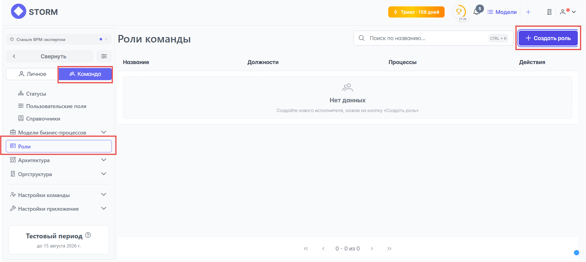

    Также роль можно создать прямо в редакторе диаграмм при работе с активными элементами диаграммы, например: {{ bpmn.end_event }} или {{ bpmn.call_activity }}. Для этого выберите активный элемент, нажмите кнопку {{ process_editor.right_toolbar.buttons.archetecture }} в правом меню и нажмите кнопку {{ universal.plus }} **Создать и установить новую роль** справа от поля **Роль**:

    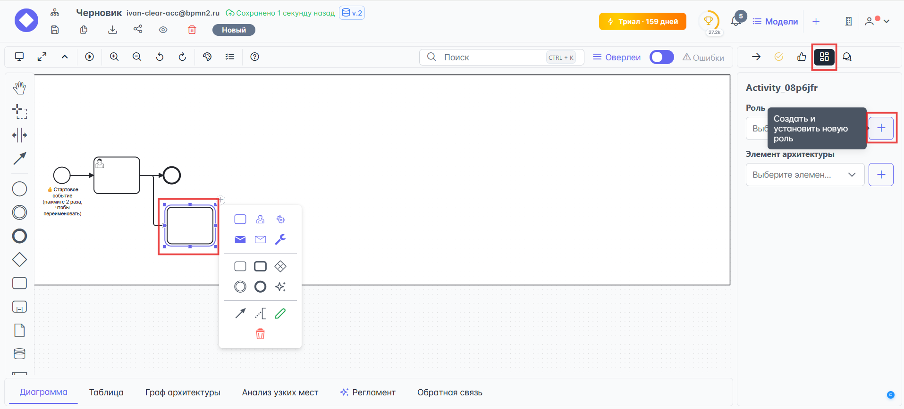

    Оба пути создания ролей приводят к одному и тому же модальному окну **Создание роли**, в котором можно задать:

    - **Название роли** (обязательное поле) — поддерживается кириллица, латиница, специальные символы (автоэкранируются).
    - **Тип роли** (обязательное поле) — один из трёх типов роли: *Человек*, *Система*, *Не указано*.
    - **Стоимость в час** (опциональное поле) — целочисленное значение (автоматическое разделение разрядов пробелом).

    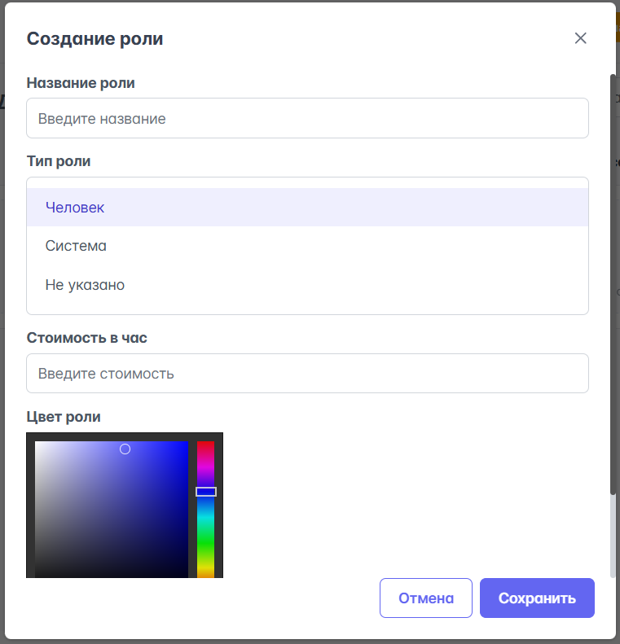

    После создания роли она появится в разделе {{ section_team.layouts.roles }}, где также отразятся: **Должности** и **Процессы**, в которых используется роль:

    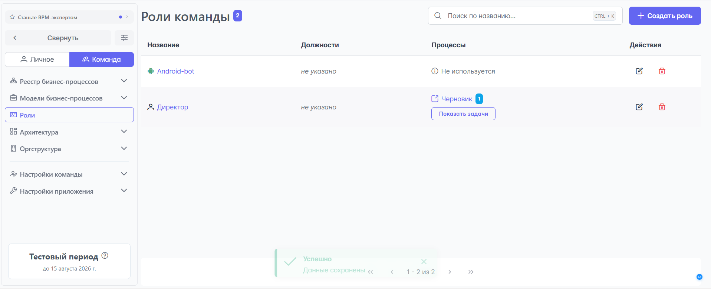

ℹ️🔽 "Редактирование ролей"
    
    Роли располагаются в разделе {{ section_team.layouts.roles }}. Там же их можно редактировать, нажав на кнопку {{ role.buttons.edit_role }}. После нажатия на кнопку откроется модальное окно **Создание роли**, в котором можно задать:

    - **Название роли** (обязательное поле) — поддерживается кириллица, латиница, специальные символы (автоэкранируются).
    - **Тип роли** (обязательное поле) — один из трёх вариантов типов роли: *Человек*, *Система*, *Не указано*.
    - **Стоимость в час** (опциональное поле) — целочисленное значение (автоматическое разделение разрядов пробелом).

    

    **Должность** присваивается **Роли** в разделе {{ org_structure.name }} {{ universal.right_arrow }}  {{ org_structure.scheme }}, а **Роль** задействуется в **Процессе** с помощью **Редактора диаграмм**. 
    
    См. **FAQ по Stormbpmn: Создание ролей**.

ℹ️🔽 "Привязка ролей к задачам"

    Роли к задачам привязываются в редакторе диаграмм:

    1. Перейдите в редактор диаграмм, выберите задачу, к которой хотите привязать роль, и в правом боковом меню выберите вкладку {{ process_editor.right_toolbar.buttons.archetecture }}:

        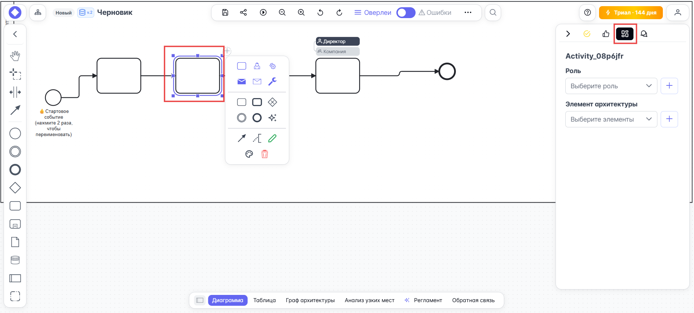

    2. Кликните по выпадающему списку **Роль** и выберите роль, которую хотите привязать к задаче:

        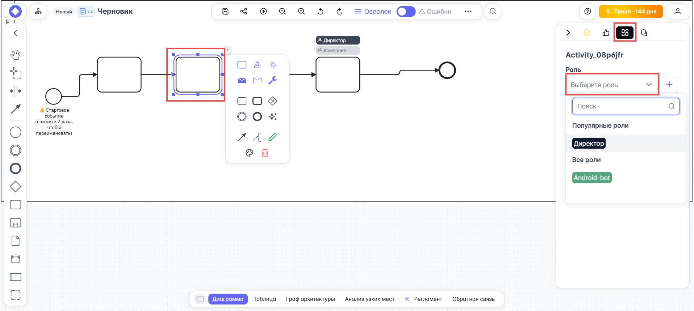

    Если нужной вам роли в списке ещё нет — создайте её, кликнув на кнопку {{ universal.plus }} **Создать и установить новую роль**. См. FAQ: Роли/создание ролей.

ℹ️🔽 "Удаление роли с задач"

    Удалить роль с задач или отвязать задачи от роли можно двумя путями:

    - Отвязать роль от задачи через редактор диаграмм.
    - Просмотреть список задач, назначенных на роль, в разделе {{ section_team.layouts.roles }}, перейти по ссылке и отвязать роль от задачи через редактор диаграмм.

    **Отвязка роли от задачи через редактор диаграмм**:

    1. Перейдите в редактор диаграмм, выберите задачу, с которой хотите отвязать роль, и в правом боковом меню выберите вкладку {{ process_editor.right_toolbar.buttons.archetecture }}:

        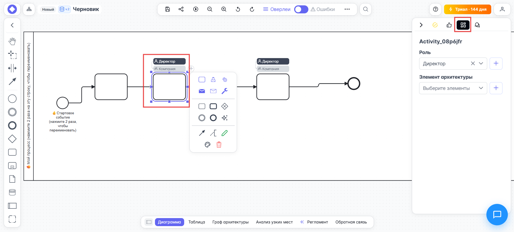

    2. Кликните на **X** справа от названия назначенной роли у задачи, чтобы отвязать роль:

        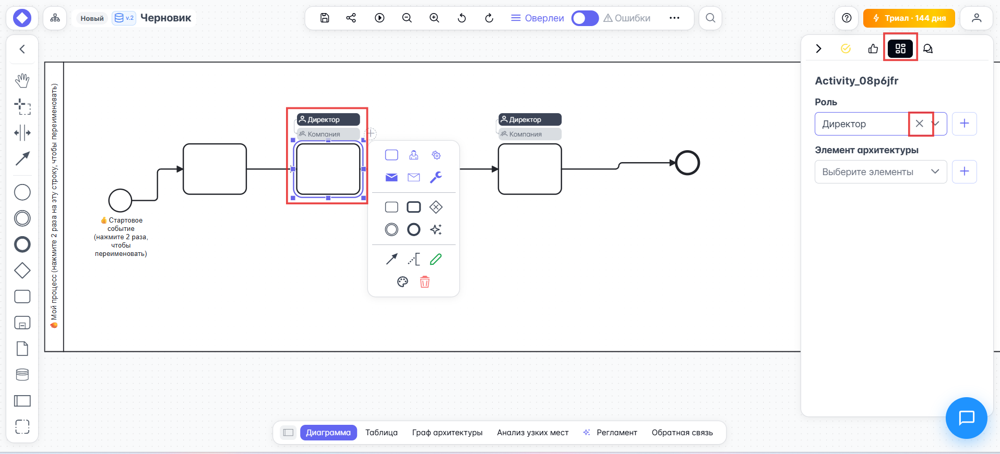

    **Отвязка роли от задачи через раздел {{ section_team.layouts.roles }}**:

    1. Перейдите в раздел {{ section_team.buttons.team_switcher }} {{ universal.right_arrow }} {{ section_team.layouts.roles }}:

        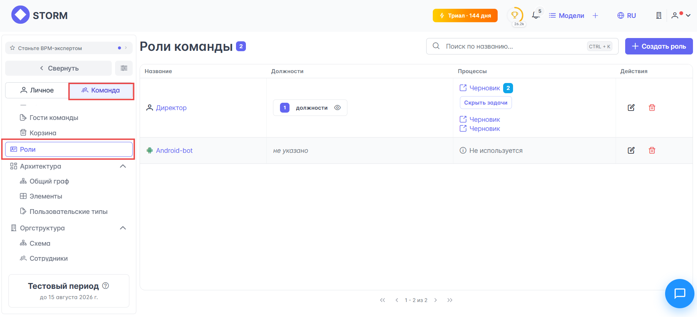

    2. В разделе будет отражён список ролей с соответствующими им должностями и процессами, в которых эти роли задействованы:

        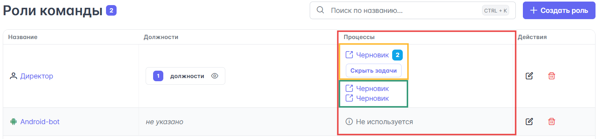

    3. Кликните по названию процесса или задачи, чтобы перейти в процесс, где к выбранной роли привязаны задачи, и в редакторе диаграмм удалить привязку или назначение.

### Реестр бизнес-процессов

ℹ️🔽 "Что такое {{ team.bp_reg.bp_tree }}?"

    Раздел {{ team.bp_reg.bp_tree }} содержит инструменты для создания и управления карточками бизнес-процессов. В разделе доступны два вида представления процессов: древовидная структура и каталог.

    {{ bp_tree.tree }} удобно использовать для создания сложных процессов с подпроцессами, а также для организации корневых процессов с переиспользуемыми подпроцессами.

    {{ bp_tree.catalog }} предназначен для систематизации уже созданных бизнес-процессов по логическим или структурным признакам.

    В разделе {{ team.bp_reg.bp_tree }} для каждого процесса можно задать следующие свойства и параметры:

    - {{ bp_tree.metrics }} — вкладка с показателями процесса. Здесь можно добавлять, искать, редактировать и удалять метрики, по которым оценивается эффективность процесса: длительность, стоимость, количество ошибок, конверсия, LTV, скорость потока, число сделок. Эти показатели помогают сравнивать состояние процесса в разные периоды и находить узкие места.
    - {{ bp_tree.options }} — вкладка с параметрами процесса. Здесь хранятся пользовательские атрибуты и контекст: уровень риска, приоритет, критичность, продукт, проект, плановая дата запуска. Параметры можно создавать, выбирать из ранее созданных и редактировать, чтобы адаптировать карточки процессов под специфику вашей компании.
    - {{ bp_tree.documents }} — вкладка с документами процесса. Здесь удобно хранить входные, внутренние и выходные документы, связанные с процессом: регламенты, инструкции, положения, методики, шаблоны, формы и подтверждающие файлы. Это помогает сохранить в одном месте схему и её документальный контекст.
    - {{ bp_tree.bpmn_models }} — вкладка со связанными BPMN-моделями. Одна карточка процесса может быть связана с несколькими диаграммами, например с текущей моделью, архивной версией или целевой TO-BE-схемой. Это позволяет вести процесс как единую сущность при изменении графического описания.
    - {{ bp_tree.reglament }} — вкладка для формирования регламента процесса. Она собирает сведения из карточки процесса и связанных моделей, чтобы выгрузить их в текстовый регламент в формате DOCX.
    - {{ bp_tree.log }} — вкладка с историей изменений карточки процесса. Помогает отследить, какие параметры, показатели или состояния процесса менялись с течением времени.

    Добавление параметров, показателей и документов к карточке процесса помогает превратить процесс в рабочий управленческий объект: понятный для исполнителей, прозрачный для владельца и удобный для анализа, улучшения и регламентации.

ℹ️🔽 "Загрузка реестра процессов из Excel"

    В разделе {{ team.bp_reg.bp_tree }} есть функции {{ bp_tree.upload_xlsx }} и {{ bp_tree.download_xlsx }}. Для удобного **импорта реестра** процессов выполните следующие шаги:

    1. Скачайте образец файла с помощью {{ bp_tree.download_xlsx }}:

        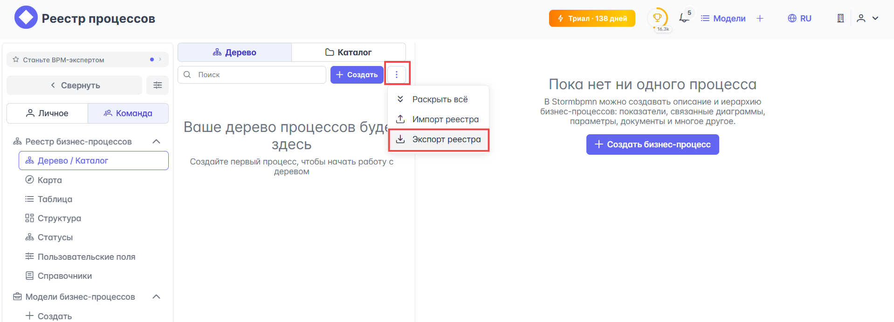

    1. Откройте xlsx-файл, перейдите на вкладку **Процессы** и заполните таблицу исходя из следующей логики:

        - Корневой процесс — самый верхний уровень без вложенности (1-й уровень). Он записывается в столбец **Процесс** и не имеет **Родителя**, например:

            | Процесс | Родитель |
            |---------|----------|
            | Найм нового сотрудника | |
        
        - Вложенный процесс/подпроцесс (2-й уровень) записывается в столбец **Процесс**, а в столбце **Родитель** указывается родительский процесс, например:

            | Процесс | Родитель |
            |---------|----------|
            | HR-скрининг | Найм нового сотрудника |
        
        - Вложенный процесс/подпроцесс (3-й уровень) записывается в столбец **Процесс**, а в столбце **Родитель** указывается процесс 2-го уровня, например:

            | Процесс | Родитель |
            |---------|----------|
            | Поиск кандидата | HR-скрининг |

        - Полная запись для таблицы процессов с тремя уровнями вложенности будет выглядеть так:

            | Процесс | Родитель |
            |---------|----------|
            | Найм нового сотрудника | |
            | HR-скрининг | Найм нового сотрудника |
            | Поиск кандидата | HR-скрининг |

    1. Данные в другие вкладки можно не вносить.
    1. Сохраните изменения в файле и импортируйте xlsx-файл с помощью инструмента {{ bp_tree.upload_xlsx }}:

        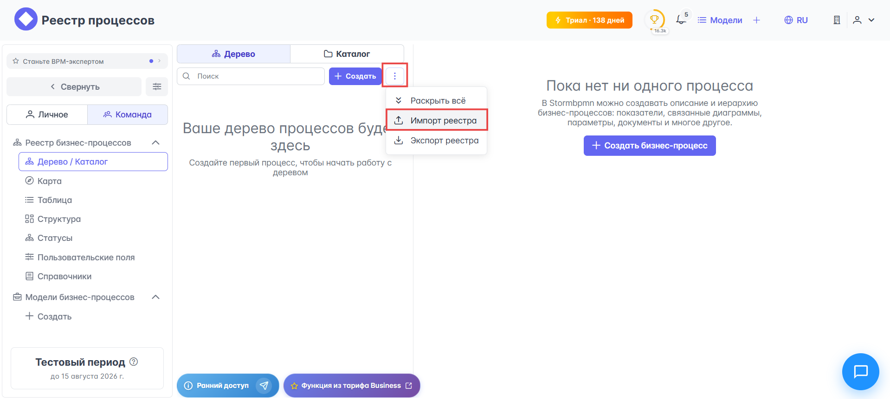

    1. Выберите файл для импорта.
    1. Ознакомьтесь с отчётом механизма импорта процессов:

        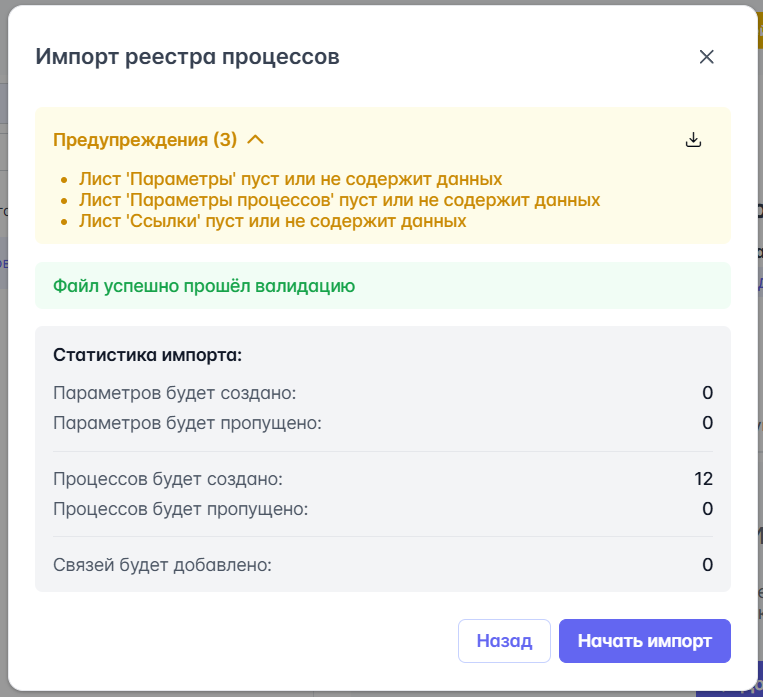
    
    1. Подтвердите импорт процессов из файла, нажав кнопку **Начать импорт**.
    1. Ознакомьтесь с отчётом об импорте процессов:

        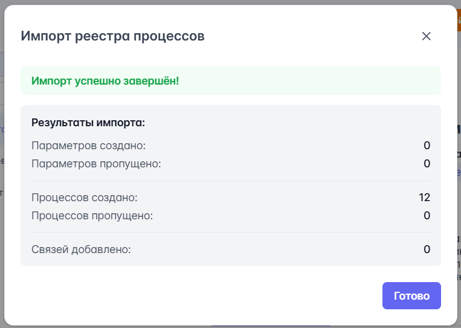
    
    После импорта в разделе {{ team.bp_reg.bp_tree }} появятся импортированные процессы:

    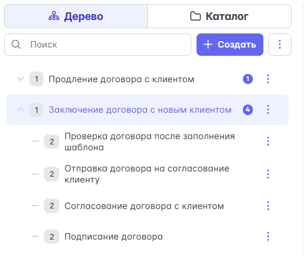

#### Справочник

ℹ️🔽 "Что такое {{ team.bp_reg.dict }}"

    Справочник — это набор заранее определенных пользовательских значений. Справочники используются для организации логически схожей информации. Проще всего представить справочник в виде выпадающего списка, в котором можно выбрать одну или несколько записей для отображения.

    Поля справочника могут быть заполнены любыми типами данных (строки, целые числа, числа с плавающей точкой, логические (булевы) значения и прочие), которые будут преобразованы в строковые данные.

    Справочники **не поддерживают** выполнение математических или логических операций над значениями.

ℹ️🔽 "Создание справочника"

    Справочники могут использоваться как наборы пользовательских параметров процессов. Например, можно задать категорию процесса или его статус. Чтобы создать справочник:

    1. Перейдите в раздел {{ team.icon }} {{ universal.right_arrow }} {{ team.bp_reg.dict }}.
    1. Нажмите кнопку {{ team.bp_reg.create_dict }}.
    1. В открывшемся модальном окне **Создание справочника** заполните следующие поля:

        - **Название справочника** — ёмкое и понятное название. Учтите, что справочник будет представлен в виде выпадающего списка — название должно отражать суть его элементов.
        - **Примечание** — описание справочника; может содержать пояснения к элементам, их свойства или отличия.
        - **Значения справочника** — элементы справочника, которые будут доступны для выбора при работе со справочником. Количество элементов не ограничено, тип данных — любой.
    1. Нажмите кнопку **Создать**.

    Созданный справочник автоматически будет отражён в разделе {{ team.bp_reg.dict }}:

    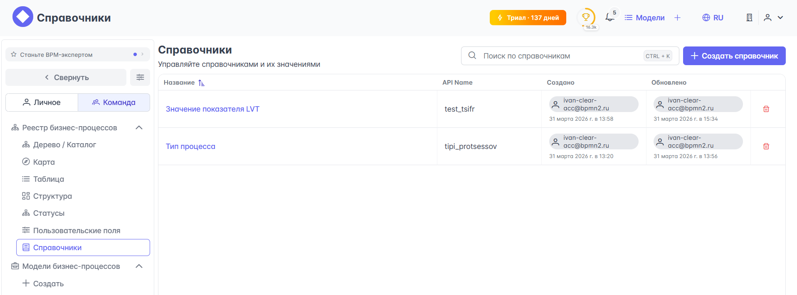

ℹ️🔽 "Использование справочника как параметра процесса"

    1. Перейдите в раздел {{ team.icon }} {{ universal.right_arrow }} {{ team.bp_reg.bp_tree }}.
    1. Выберите бизнес-процесс, к которому хотите добавить справочник, перейдите во вкладку {{ bp_tree.options }} карточки бизнес-процесса и нажмите {{ universal.plus }} **Добавить параметр**:

        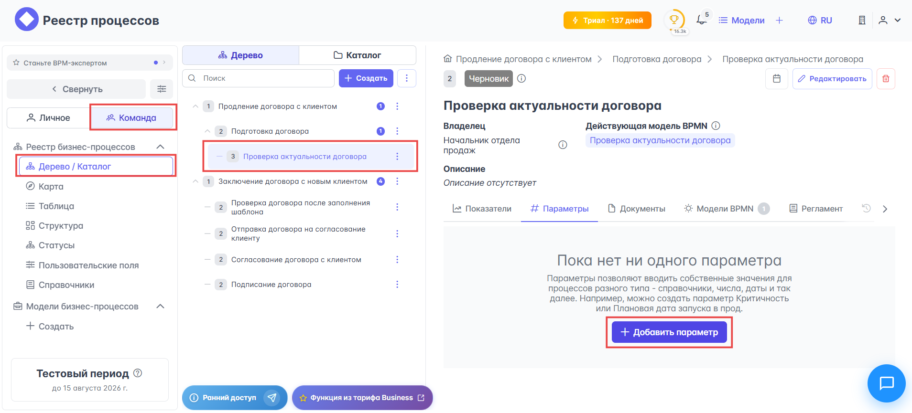
    
    1. В открывшемся модальном окне **Добавление параметра** нажмите {{ universal.plus }}.
    1. На шаге **Создание параметра** выберите **Тип параметра**: **Одиночный выбор** для представления справочника в виде выпадающего списка с возможностью выбора одной записи или **Мульти-выбор** для выбора нескольких значений справочника.
    1. После выбора типа параметра в форме появятся новые поля:

        - **Название** — укажите название параметра. Оно будет отображаться в {{ bp_tree.options }}.
        - **Подсказка для ввода** — пояснение для выбора значений параметра.
        - **Справочник** — выбор справочника для привязки к параметру карточки процесса.
        - **Примечание** — дополнительное описание параметра.
    1. Нажмите кнопку **Сохранить**, затем **Добавить**.
    1. После добавления параметра к процессу он будет отражён в секции {{ bp_tree.options }}:

        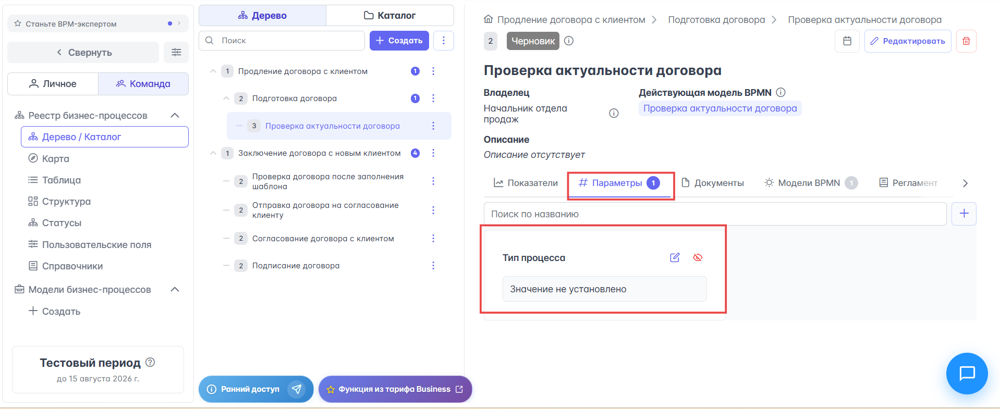
    1. Активируйте поле **Значение не установлено** и выберите нужное значение из выпадающего списка.

    После первой привязки справочника к процессу и назначения ему имени как параметру, справочник можно добавлять к другим процессам через кнопку {{ universal.plus }} **Добавить параметр**.

ℹ️🔽 "Удаление справочника"

    ⚠️ "Привязка к полям процесса"

        Справочник, привязанный к полям процесса, невозможно удалить. Сначала нужно отвязать справочник в карточке процесса в секции {{ bp_tree.options }}.

    Для удаления справочника нажмите на {{ universal.delete }} справа от столбца **Обновлено**:

    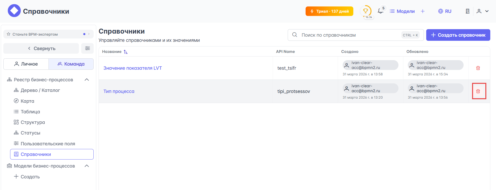

## Тарифы

ℹ️🔽 "Переход с базового тарифа на тарифы **Team** и **Business**"

    1. Войдите в аккаунт и в рабочее пространство {{ product_name }}.
    2. Кликните по кнопке {{ account_dropdown_menu.icon }} в верхней панели управления справа.
    3. Из выпадающего списка выберите пункт {{ account_dropdown_menu.upgrade_plan }}:

        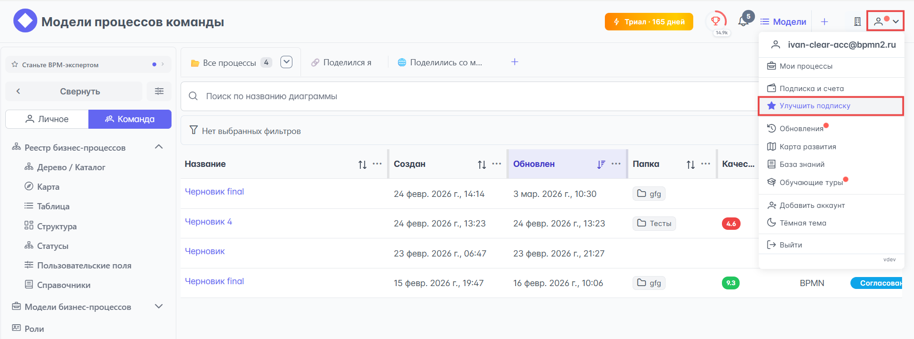
    
    4. Выберите интересующий вас тариф:

        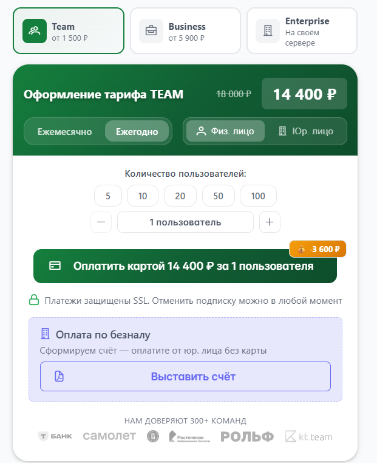

    Кликните на свернутую внизу экрана подсказку **Сравнение тарифов** для получения списка возможностей каждого тарифа и их наглядного сравнения.