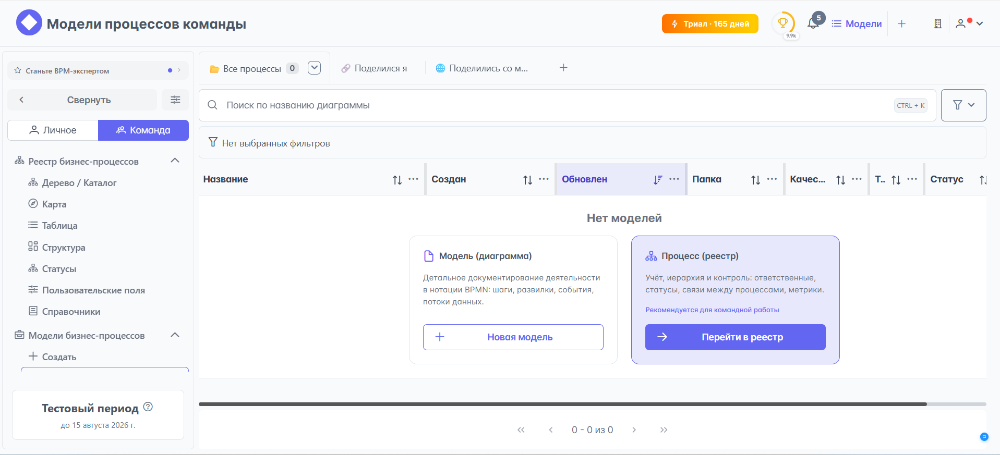
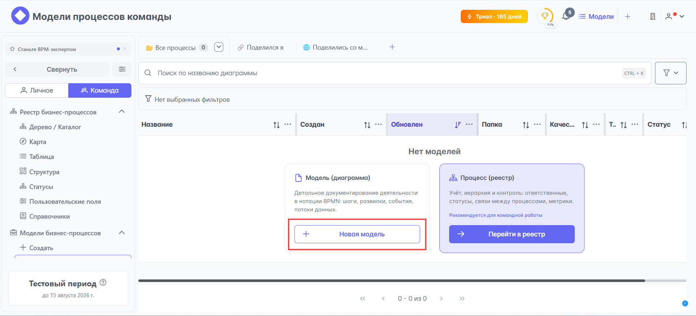
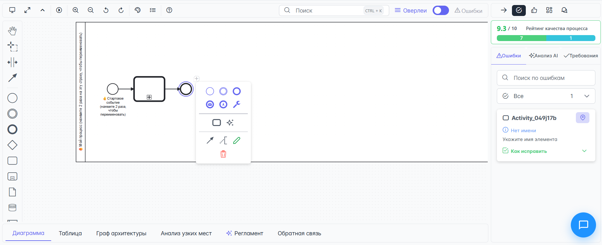
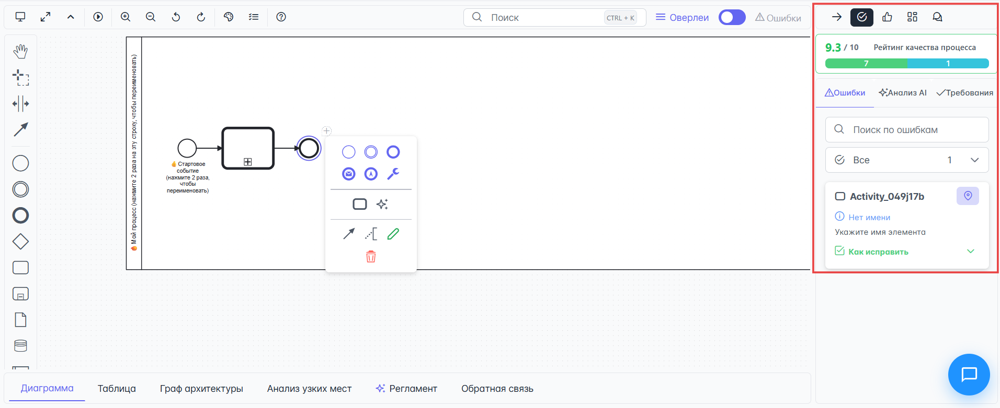
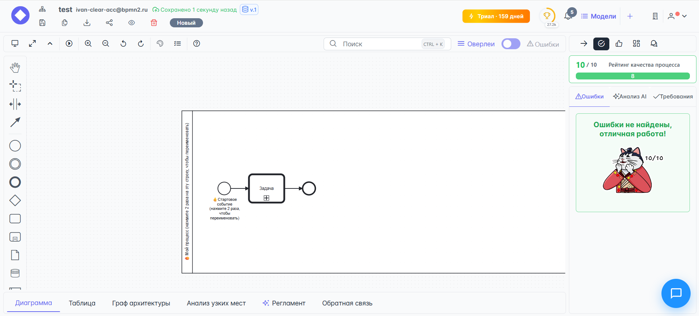
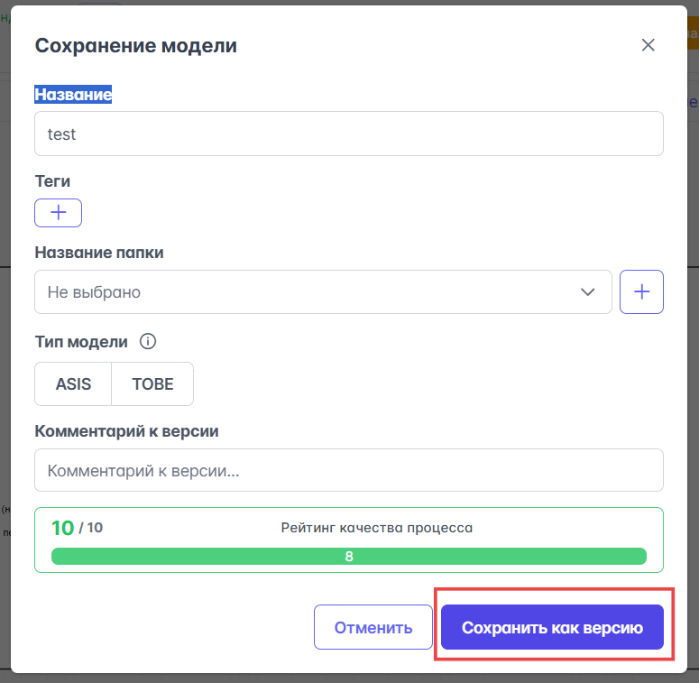

# Быстрый старт

После активации аккаунта и входа в систему — вы окажетесь на главной странице {{ product_name }}, где при первом входе в систему не будет моделей процессов:

Для быстрого ознакомления с возможностями {{ product_name }} по работе с моделями и быстрого старта — рекомендуем создать тестовую модель. Нажмите на кнопку {{ main_window.create_model_modal_window.create_new_model_button }} в диалоговом окне {{ main_window.create_model_modal_window.window_name }}:

Откроется модальное окно **Создать модель**, в котором будет предложено создать модель одним из следующих способов:

- {{ create_model.blank }} — начните создание диаграммы с пустого холста.
- {{ create_model.template }} — импортируйте существующий BPMN-файл для редактирования.
- {{ create_model.upload }} — выберите готовый шаблон BPMN диаграммы для быстрого старта.
- {{ create_model.ai }} — создайте диаграмму с помощью искусственного интеллекта.
- <i class="pi pi-clone"></i> **Скопировать модель** — создайте копию существующей модели для модификации.

Рекомендуем начать знакомство с возможностями {{ product_name }} с создания модели {{ create_model.blank }} — это хороший выбор для быстрого старта, чтобы сосредоточиться на основном и не утонуть в обилии элементов модели с самого начала.

После открытия главного окна **Редактирование модели** вы увидите черновик модели, состоящий из стартового события. Минимальная рабочая диаграмма должна состоять из: стартового события, задачи и конечного события.

Добавить перечисленные элементы на диаграмму проще всего, кликнув по стартовому событию и из раскрывшегося списка доступных элементов модели выбрать последовательно {{ bpmn.call_activity }} и {{ bpmn.end_event }}:

После добавления перечисленных элементов диаграммы интерактивная система проверки ошибок, расположенная в правой боковой панели, в разделе {{ process_editor.right_toolbar.buttons.check_mistakes }} покажет отсутствие ошибок, один недочёт и оценку качества процесса выше 9 баллов:

Устранить недочёт и получить 10 из 10 баллов качества процесса можно задать имя {{ bpmn.call_activity }} двойным кликом по элементу диаграммы:

Осталось сохранить модель, и можно сказать, что быстрый старт удался. Для сохранения модели кликните по кнопке {{ process_editor.upper_toolbar.buttons.save_as_version }}, затем укажите **Название** модели и нажмите кнопку {{ process_editor.save_process_modal.buttons.save }}:

Теперь можно сказать, что быстрый старт в {{ product_name }} завершён. Мы создали базовую, простую и рабочую модель. Далее модель можно усложнять, добавляя другие логические элементы процесса, например, как показано в этом [видеопримере](https://youtu.be/43dF52i1ksA?si=X4vB2RoGXdUJX5eF).
